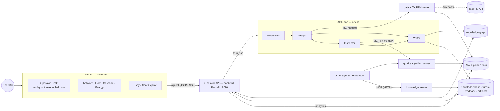
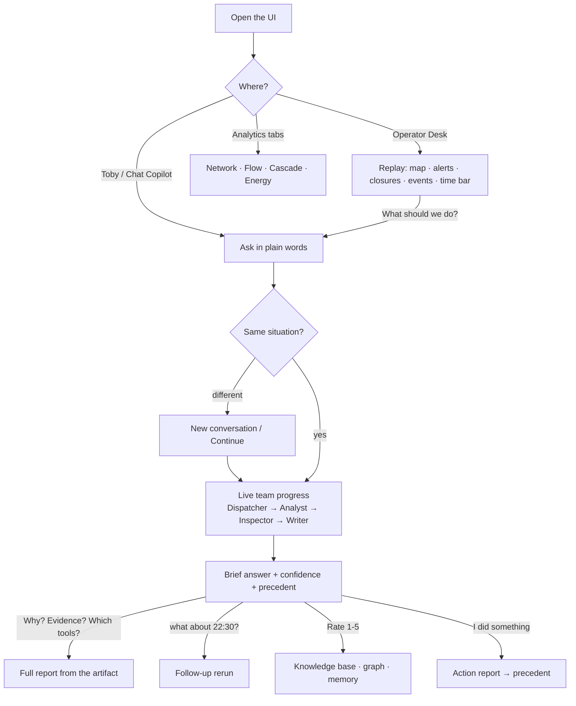
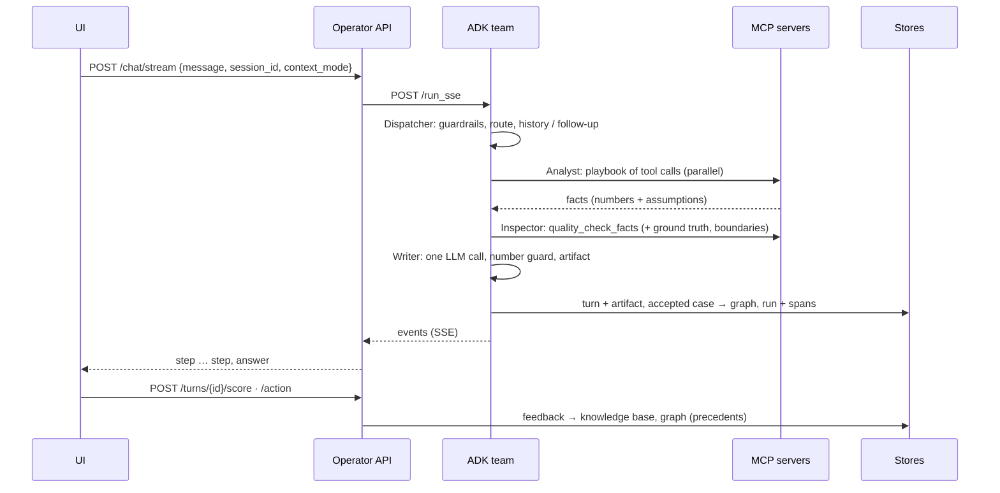

# Talk To My Train

**An AI team for the control room** — InnoTrans 2026 hackathon, Berlin U-Bahn. An operator asks in plain words ("Line U7 is suspended between Hermannplatz and Karl-Marx-Straße tonight — how do we reroute, who gets overloaded, where should staff go?"); a small team of agents pulls the numbers through MCP tools, **recomputes the key figures before anything is shown**, and answers with a one-screen brief. The operator rates the answer and reports what they actually did; that becomes a precedent for the next similar situation. *Advisory only — the operator decides.*

| Role (pitch name) | What it does | Code |
| --- | --- | --- |
| **Dispatcher** | understands the question, routes it, rejects off-topic or manipulative requests | `agent/supervisor.py`, `router.py`, `guardrails.py` |
| **Analyst** | pulls the data through MCP connectors and runs the load forecast (TabPFN) | `agent/worker.py`, `specialists.py`, `executor.py` |
| **Inspector** | recomputes key numbers from the raw data — ground truth, boundaries and the quality database — before anything is shown; can ask the Analyst to revise | `agent/evaluator.py`, `loop.py`, `quality_mcp.py` |
| **Writer** | one-screen brief: verdict · evidence · do now · caveat · sources; full report only on request | `agent/writer.py`, `artifacts.py` |

Stack: Google **ADK** (agents) · **FastMCP** (3 servers, 57 tools) · **TabPFN** (tabular foundation model) · **LiteLLM** (Azure / OpenAI models per role) · FastAPI · React + Vite · SQLite (+ Neo4j, Cognee optional) · Streamlit.

---

## 1. Quick start

```bash
make install     # once: .venv + every dependency (+ the UI build if npm exists)
make up          # prepares what is missing, starts everything, prints the addresses
make down        # stop it
make check       # unit tests + guardrail suite + router accuracy — no LLM, no network
make ui          # UI with hot reload on :3000 (needs `make up` for the API)
make docs        # regenerate docs/generated (MCP tool catalogue, API endpoints, OpenAPI)
```

You need Python 3.12, Node.js 18+ (UI), optionally Docker (Neo4j). Put keys in `.env` (never committed): `TABPFN_API_TOKEN`, the LLM settings per role (`SUPERVISOR_*`, `WORKER_*`, `WRITER_*`, …); details in [`docs/modules/scripts_and_ops.md`](docs/modules/scripts_and_ops.md).

| After `make up` | Address | What |
| --- | --- | --- |
| **Operator UI** | http://127.0.0.1:8770/app/ | Operator Desk · Chat Copilot · Network & Heatmap · Flow Analytics · Cascade Simulator · Energy Efficiency · Toby (floating assistant) |
| Operator API | http://127.0.0.1:8770/docs | Swagger of the API behind the UI |
| ADK dev UI | http://localhost:8000/dev-ui/?app=agent | chat with the agent, events, traces, evals |
| Dashboard | http://localhost:8501 | Streamlit: data, ML engine, observability, evaluation, workflow, resources |
| MCP quality / knowledge | http://127.0.0.1:8768/mcp · :8766/mcp | for other agents and inspectors |
| Neo4j browser | http://localhost:7474 | the knowledge graph (Docker) |

The first question after a cold start can take ~30 s (TabPFN warm-up); later ones 2–5 s. Ports move to the next free one if taken.

---

## 2. System design



**Design principles**

1. **The model never invents a number.** Facts come from deterministic MCP tools; the Writer is the only generative step, and a guard replaces the brief by a template rendering if a number is not in the facts.
2. **Verify before showing.** The Inspector checks the result against the objective, ground truth recomputed from the raw CSVs, knowledge-base boundaries and the quality database; ground truth outranks the LLM; the Analyst ⇄ Inspector loop is hard-bounded (2 rounds, 40 s).
3. **Honest limits.** Off-topic → bounce; related but unsupported (capacity, delays, costs) → decline with what *is* possible; assumptions and proxies are stated in the answer.
4. **One conversation = one situation.** A message that does not fit the current situation triggers a *New conversation / Continue* choice instead of silently mixing topics.
5. **Brief by default, full report on request** — the report is built from a stored artifact bundle (plan, every tool call with arguments and time, checks, confidence reasons), never from the model's memory.
6. **Close the loop.** Ratings and "what I did" reports feed the knowledge base and the graph; similar future answers show *what operators did and how it went*.
7. **Everything is observable.** Every question is a run with events, spans, tokens, times, tool calls.

Deeper: [`docs/agent_architecture_v3.md`](docs/agent_architecture_v3.md) (design and guardrails), [`docs/modules/agent.md`](docs/modules/agent.md).

### Components

| Component | Folder | Module page |
| --- | --- | --- |
| Agents (Dispatcher · Analyst · Inspector · Writer, guardrails, knowledge, feedback) | `agent/` | [agent.md](docs/modules/agent.md) |
| MCP servers (data + TabPFN, knowledge, quality + golden) | `mcp_server/` | [mcp_server.md](docs/modules/mcp_server.md) |
| ML (TabPFN models, disruption logic, normalization pipeline, quality database) | `ml/` | [ml.md](docs/modules/ml.md) |
| Operator API, chat bridge, analytics and replay data | `backend/` | [backend.md](docs/modules/backend.md) |
| Operator UI | `frontend/` | [frontend.md](docs/modules/frontend.md) |
| Streamlit dashboard | `dashboard/` | [dashboard.md](docs/modules/dashboard.md) |
| Evaluation and experiments | `evaluation/`, `experiments/` | [evaluation.md](docs/modules/evaluation.md) |
| Scripts, Makefile, tests | `scripts/`, `tests/` | [scripts_and_ops.md](docs/modules/scripts_and_ops.md) |
| Data, knowledge, stores | `data/`, `knowledge/`, `observability/` | [data.md](docs/modules/data.md) |

---

## 3. User flow



Operator options in the chat (kept from the first desktop and in the new UI): history of conversations and resume · topic pill and topic-switch choice · **Rate 1–5** · **Why? / Evidence / Which tools?** · **"I did something"** (as recommended / modified / other / nothing, outcome) · operations column (tool calls, inference time, tokens, time split, step log) · microphone and speak-the-answer. UI details: [`docs/operator_desktop.md`](docs/operator_desktop.md), migration: [`docs/frontend_migration.md`](docs/frontend_migration.md).

---

## 4. Data flow



Read path (analytics tabs, desk) never touches the agent: UI → API → merged raw CSVs. Build path: raw CSVs → `ml/nextmove_pipeline` → `data/normalized` → `data/quality`; raw CSVs → `knowledge/knowledge.json`; seed → `kgraph.db`. Full diagrams (feedback loop, storage moments, timing): [`docs/events_and_data_flow.md`](docs/events_and_data_flow.md).

---

## 5. Events and tracing

The agent pipeline emits ADK events; `customMetadata.kind` tells what an event is, and the operator API turns them into the live steps of the UI.

| `kind` | Meaning | UI stage |
| --- | --- | --- |
| `supervisor` | the Dispatcher's plan: decision, category, route | Dispatcher |
| `mcp_call` / `mcp_result` | a tool call starts / ends (arguments, seconds, bytes, ok) | Analyst |
| `worker_round` | end of an Analyst round (tools, confidence) | Analyst |
| `evaluator` | Inspector verdict: accept / revise / reject, score, issues | Inspector |
| `llm` | one LLM inference (role, model, seconds, tokens) | by role |
| `facts`, `timing` | facts final; time split (Dispatcher / Analyst+Inspector / MCP / Writer / total) | — |
| `answer` | final text + turn id, artifact id, `requires_action`, precedent, guard | Writer |

Server-Sent Events of `POST /api/v1/chat/stream`: `choice` · `step` · `answer` · `error`. OpenTelemetry spans (`dispatcher.plan`, `analyst.loop`, `mcp.tool <name>`, `inspector.check`, `inspector.quality_mcp`, `llm.write`, `guard.check`, `kb.sanity`, `kg.record_case`, …) and one `runs` row per question go to `observability/agent_obs.db` (dashboard page *Observability*). Catalogue with fields: [`docs/events_and_data_flow.md`](docs/events_and_data_flow.md) §5–6.

---

## 6. Data schema

| Layer | Where | Detail |
| --- | --- | --- |
| Raw data (organisers): flows, weather, stations, connections, events, closures, energy — 15-minute grain, 167 stations, 8 lines (U1–U3, U5–U9), 2026-06-10 → 2026-10-01 | `data/training dataset`, `data/testing dataset` | [`data/dataset_schema.md`](data/dataset_schema.md) |
| Golden data: normal flow, normalized flows / weather / rest, episodes, coefficients | `data/normalized`, `data/processed` | [`data/data_schema_high_quality.md`](data/data_schema_high_quality.md) |
| Quality database: boundaries per station × day type × hour, ceilings, anomalies, outages, data issues | `data/quality/quality.db` | [`docs/data_schema.md`](docs/data_schema.md) §4.5 |
| Knowledge base: 14 boundaries, 37 ground-truth facts, 4 insights | `knowledge/knowledge.json` | §3 |
| Operator knowledge base: `turns` (answer, facts, plan, verdict, **artifact bundle**, score), `operator_feedback`, `insights` | `observability/memory.db` | §4.1 |
| Knowledge graph: Problem · Situation · Conversation · Answer · Action · Option · ActionType · Category · Domain · Station · Line · Artifact · Tool · Dataset · Model · Feedback … (754 nodes / 1240 edges) | `observability/kgraph.db` (+ Neo4j) | §7 |
| Observability and evaluation: `runs`, `spans`, `eval_*`, `exp_*`, `ls_*`, `sub_*` | `observability/agent_obs.db`, `submissions.db` | §4.2–4.3 |
| Agent messages (21 pydantic models, versioned, `extra="forbid"`): `SupervisorPlan → WorkerResult → EvaluatorVerdict → FinalAnswer` … | `agent/schemas.py`, `docs/schemas/` | §6 |
| API payloads | operator API | [`docs/api_reference.md`](docs/api_reference.md), `docs/generated/openapi.json` |

Everything in one place: [`docs/data_schema.md`](docs/data_schema.md).

---

## 7. Tool calling and MCP

Three FastMCP servers, **57 tools**. The Analyst runs a fixed playbook of tool calls per question category (independent calls in parallel); the Inspector checks with the quality server; other agents can use all three over MCP.

| Server | Tools | Transport | Used by |
| --- | ---: | --- | --- |
| **data + TabPFN** (`mcp_server/server.py`) — dataset, disruption (`resolve_closure`, `apply_closure`, `alternate_paths`, `scenario_flow`), analytics (`event_impact`, `rank_pressure`, `find_anomalies`, `energy_efficiency`, `network_resilience_ranking`, `correlated_stations`, `reroute_behaviour`), forecasts (`predict_expected_flow`, `predict_overcrowding_risk`) | 17 | stdio (warm subprocess), optional HTTP :8765 | Analyst |
| **knowledge** (`knowledge_server.py`) — `kb_*`, `sanity_check`, `session_history`, `cognee_recall`, `kg_*`, `operator_*` | 18 | HTTP :8766 | other agents / evaluators |
| **quality + golden** (`quality_server.py`) — `quality_*` (boundaries, plausibility checks, episodes, anomalies …), `golden_*` (the pre-processed files) | 22 | HTTP :8768, in-memory for the Inspector | Inspector, outside clients |

| Category | Question type | Tools |
| --- | --- | --- |
| C | line / station closure: reason, reroute, who is overloaded, where to staff | `resolve_closure` → `apply_closure` ∥ `alternate_paths` → `scenario_flow` |
| D | station profile, commute peak, prediction at a time | `resolve_station` → `station_profile` (+ `predict_*`) |
| A · P · B | events · pressure ranking · anomalies and root cause | `event_impact` · `rank_pressure` · `find_anomalies` |
| E · F · G · H | energy per passenger · resilience · latent correlations · reroute behaviour | `energy_efficiency` · `network_resilience_ranking` · `correlated_stations` · `reroute_behaviour` |
| X | strategy / investment | planned — declined honestly |

Full catalogue with parameters (generated): [`docs/generated/mcp_tools.md`](docs/generated/mcp_tools.md) · how a call travels and how to call from outside: [`docs/mcp_and_tools.md`](docs/mcp_and_tools.md).

---

## 8. API

Operator API (FastAPI, `backend/operator_api.py`), base `http://127.0.0.1:8770/api/v1`:

| Group | Endpoints |
| --- | --- |
| chat | `POST /chat` · `POST /chat/stream` (SSE) · `GET /conversations` · `GET /conversations/{id}` |
| feedback | `POST /turns/{id}/score` · `POST /turns/{id}/action` · `POST /feedback` · `PATCH/DELETE /feedback/{id}` · `GET /feedback/pending` · `/feedback/stats` · `/enums` |
| knowledge | `GET /turns` · `/turns/{id}` · `/turns/{id}/artifact` · `/turns/{id}/report` · `/artifacts/search` · `/precedents` · `/operator-actions` · `/health` |
| graph | `GET /graph/stats` · `/graph/taxonomy` · `/graph/audit` · `POST /graph/repair` |
| replay | `GET /ops/topology` · `/ops/timeline` · `/ops/snapshot?at=` · `/ops/series?date=` |
| analytics | `GET /status` · `/stations` · `/network/edges` · `/flows/daily` · `/flows/hourly-profile` · `/flows/heatmap` · `/flows/station/{name}` · `/closures` · `/centrality` · `/energy` · `POST /cascade` |

Reference with examples and the SSE format: [`docs/api_reference.md`](docs/api_reference.md) · generated table: [`docs/generated/operator_api.md`](docs/generated/operator_api.md).

---

## 9. Repository map

```
agent/        the agent team (ADK app), guardrails, knowledge base, graph, feedback, observability
mcp_server/   FastMCP servers: data + TabPFN, knowledge, quality + golden
ml/           TabPFN models, disruption logic, normalization pipeline, quality database, golden data access
backend/      operator API (FastAPI), chat bridge, analytics and replay data
frontend/     React operator UI (Vite)          frontend_old/  first desktop, archived
dashboard/    Streamlit dashboard
evaluation/   ground truth, judge, metrics, organiser workbook runs      experiments/  component study
scripts/      services supervisor, task runner, doc generator
tests/        137 offline tests
data/         raw (training / testing), normalized, processed, quality
knowledge/    curated knowledge base (built from the raw data)
observability/  runtime stores (git-ignored)
docs/         documentation (index: docs/README.md) — docs/modules/ per module, docs/generated/ machine-derived
```

## 10. Honest limits

* The flows and closures are **simulated**; a model that fits them shows how the simulation behaves. Only ~30 closures exist, so the disruption model predicts a *baseline* and the diversion share (25 / 50 / 75 %) is a stated assumption.
* No capacity, delay, cost, rolling-stock or timetable data: such questions are declined with what is possible; the energy-per-passenger figure is a proxy.
* No live feed: the desk replays the recorded window.
* Strategy / investment questions (Category X) are planned, not built; categories A, P, B, G, H are *partial* (answer with stated proxies).
* The first question after a cold start waits for TabPFN; TabPFN and the LLMs run on external services (no data leaves the machine otherwise; Cognee and LangSmith are opt-in).
* No authentication on the API — for `127.0.0.1` demos.

## 11. Testing and evaluation

`make check` → **137 tests**, guardrail suite **46/46** (no LLM), router **71/75** on the question bank. The organiser's workbook has been answered end to end and the runs stored and comparable: [`docs/submission_run_report.md`](docs/submission_run_report.md); metrics, judge and experiments: [`docs/observability_and_evaluation.md`](docs/observability_and_evaluation.md), [`docs/experiments_plan.md`](docs/experiments_plan.md). The UI was verified with a headless-Chrome run (all tabs, one real question through Toby).

## 12. Documentation index

Start with [`docs/README.md`](docs/README.md). Most useful: [`docs/modules/`](docs/modules/README.md) (one page per module) · [`docs/api_reference.md`](docs/api_reference.md) · [`docs/mcp_and_tools.md`](docs/mcp_and_tools.md) · [`docs/events_and_data_flow.md`](docs/events_and_data_flow.md) · [`docs/data_schema.md`](docs/data_schema.md) · [`docs/frontend_migration.md`](docs/frontend_migration.md) · [`docs/running_the_system.md`](docs/running_the_system.md) · [`docs/presentation_guide.md`](docs/presentation_guide.md).
