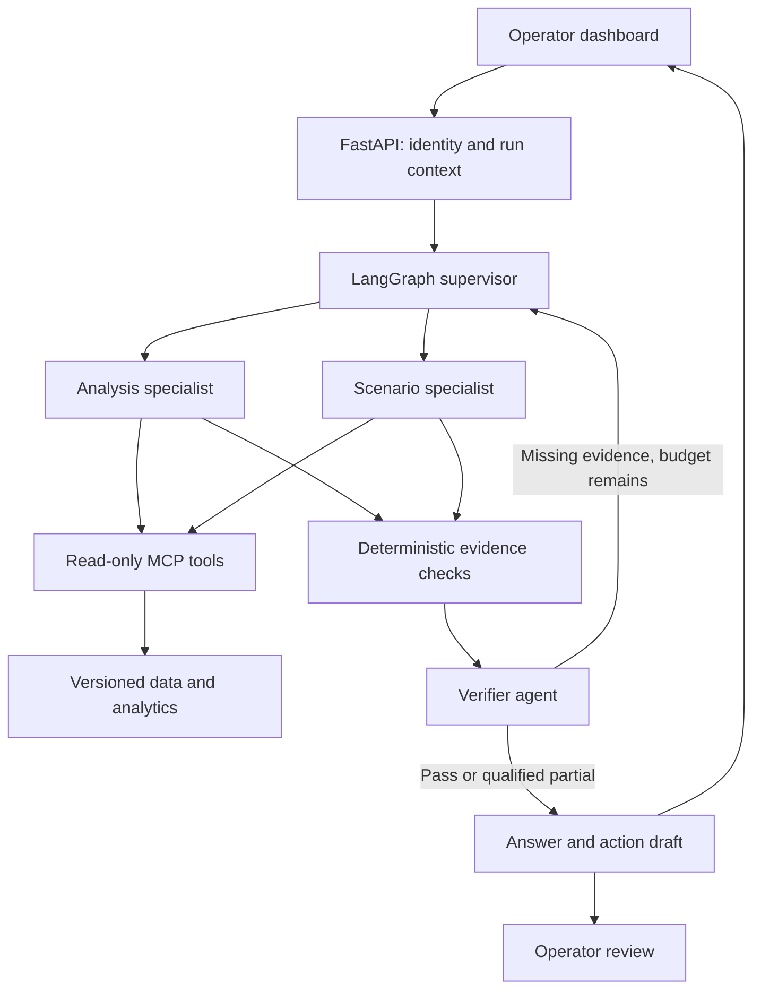

# Talk To My Train — Agentic engineering blueprint

Prepared 23 September 2026 for the InnoTrans hackathon. Architecture recommendations, proposed contracts and acceptance targets; not an implemented or railway-certified system.

## 1. Recommendation and scope

Build an **evidence-first operator decision-support application** using Python, LangGraph, FastMCP, DuckDB, NetworkX, FastAPI, Streamlit, Langfuse and OpenTelemetry. Use the organizer's LLM endpoint initially. Implement a small supervisor-led team with bounded specialist subgraphs, deterministic analytics, explicit evidence contracts and an operator review boundary.

The main engineering investment should be data semantics, reliable tools and evaluation. Multiple agents are useful where they isolate responsibilities or allow independent checks; each additional agent must justify its latency and failure modes.

Your supplied `agentic_system_design.md` recommends one orchestrator. Preserve that as the baseline, then add a scenario specialist and verifier for complex questions. Compare the two configurations experimentally. The recommended final architecture accommodates multiple agents without requiring every question to visit all agents.

**MVP output:** a concise answer, a map/table, observed-versus-estimated labels, assumptions, source references, and an inspectable execution trace. Proposed operational responses remain drafts for operator review. No interfaces to signalling, interlocking, traction power, dispatch control or passenger announcements in the hackathon.

### Evidence available for this design

- Read: `innotrans2026_hackathon_problem_statement.md` and `agentic_system_design.md`.
- Not supplied: actual CSVs, schema file, original training questions/answers, evaluation PDF, dashboard repository, model endpoint contract, live feeds and approved operating procedures.
- Consequently, dataset counts, completeness, specific event rows, graph size and existing dashboard functions are claims from your analysis, not independently verified findings here.
- The problem statement gives two different end dates for the additional dataset: September 30 and October 1. Discover actual coverage during ingestion; do not hard-code either date.
- The problem statement calls energy network-level; your analysis discusses line-level energy. Inspect the actual schema before promising line rankings.
- External technical documentation was checked during this research. Concrete design choices and acceptance targets below are my recommendations, not vendor guarantees.

## 2. Technology choices

| Layer | Recommended choice | Purpose and rationale | Hackathon scope |
|---|---|---|---|
| Language/contracts | Python + Pydantic | Share analytics with your Python dashboard; validate tool arguments and results | Required |
| Orchestration | LangGraph | Explicit state transitions, bounded loops, checkpointing and human review | Required |
| MCP server | Standalone FastMCP | Typed domain tools over a standard interface | One read-only service |
| MCP client | FastMCP client behind your own thin adapter | Keep orchestration independent of changing framework integrations | Required |
| Analytics | DuckDB + Parquet; pandas where existing code needs it | Deterministic filtering, joins, aggregations and reproducible snapshots | Required |
| Graph | NetworkX | Closure-aware paths, components, resilience and route validation | Required |
| Statistics | NumPy/SciPy | Robust baselines, correlations, uncertainty and comparisons | Required |
| Model | Organizer-provided endpoint | Avoid provisioning GPUs during the competition | Capability-test first |
| API | FastAPI | Request validation, authorization boundary, run status and evidence endpoints | Required |
| UI | Existing Streamlit dashboard + chat | Reuse the team's visualization work; map, timeline and evidence drawer | Required |
| State | SQLite checkpoint backend on one machine; PostgreSQL for shared deployment | Resume runs and retain operator review state | SQLite initially |
| LLM observability | Langfuse | Trace inspection and evaluation datasets | Managed if permitted; otherwise self-host |
| Cross-service tracing | OpenTelemetry | Link API, agent and MCP execution | Explicit trace propagation |
| Verification | pytest + versioned evaluation fixtures | Numeric, topology, provenance and failure-path checks | Required |
| Delivery | Docker Compose + locked dependencies | Reproduce one known configuration | Required |
| Later model hosting | vLLM + a benchmark-selected model | Local model serving when deployment and data requirements justify it | Post-hackathon |

LangGraph supports mixing deterministic and model-driven steps; persistence supports checkpoints, and interrupts provide pause/resume mechanisms. Those capabilities match the proposed orchestration boundary. [LangGraph overview](https://docs.langchain.com/oss/python/langgraph/overview), [persistence](https://docs.langchain.com/oss/python/langgraph/persistence), [interrupts](https://docs.langchain.com/oss/python/langgraph/interrupts).

FastMCP provides a Python MCP framework. DuckDB directly handles analytical queries on CSV/Parquet, and NetworkX supplies graph algorithms. Pydantic supplies typed validation; successful schema validation still does not establish factual correctness. [FastMCP](https://gofastmcp.com/getting-started/welcome), [DuckDB](https://github.com/duckdb/duckdb), [NetworkX paths](https://networkx.org/documentation/stable/reference/algorithms/shortest_paths.html), [Pydantic models](https://pydantic.dev/docs/validation/latest/concepts/models/).

### Framework decision

| Candidate | Suitable use | Decision for this project |
|---|---|---|
| LangGraph | Explicit workflows with agentic branches and persistent state | First choice: clear control of retries, review and evidence flow |
| PydanticAI | Typed Python agents and structured application integration | Good alternative if the team already knows it; avoid adding a second agent runtime |
| CrewAI Flows | Event-driven orchestration and role-oriented agent applications | Viable, but the existing question matrix fits an explicit state graph well |
| Plain Python state machine | Small fixed workflows | Excellent baseline and deterministic fallback |

These are project-fit judgments, not performance rankings. See [PydanticAI](https://pydantic.dev/docs/ai/overview/) and [CrewAI Flows](https://docs.crewai.com/en/concepts/flows). Anthropic's engineering guidance also distinguishes predefined workflows from more autonomous agents and recommends complexity only where it improves results. [Building effective agents](https://www.anthropic.com/engineering/building-effective-agents).

**Version caution:** the LangChain MCP integration page checked for this report describes `langchain.mcp.MCPAdapter` as beta and documents migration from `langchain-mcp-adapters`. Do not combine snippets from both APIs. Prefer a narrow MCP client wrapper, or lock one tested integration. Standalone `fastmcp` and the official SDK's `mcp` package are distinct packages; do not mix imports casually. [LangChain MCP](https://docs.langchain.com/oss/python/langchain/mcp), [official MCP Python SDK](https://github.com/modelcontextprotocol/python-sdk).

Do not add a vector database for numeric CSV retrieval. If approved operating manuals become available, add a separately versioned document retrieval tool; exact procedure IDs and applicability matter more than embedding similarity alone.

## 3. System architecture



The graph is control flow. Every node emits a linked trace span and state update; telemetry is omitted from the diagram for readability. Operator review records acceptance/rejection of a draft in the MVP; it does not execute railway actions.

### Agent responsibilities

| Role | Inputs | Allowed capabilities | Output | Invocation |
|---|---|---|---|---|
| Supervisor | Question, identity, scenario clock, data manifest | Entity lookup; select category and specialist; bounded replanning | Typed plan with dependencies and required evidence | Every request |
| Analysis specialist | Scoped question and resolved IDs | Flow, event, weather, energy and statistical tools | Evidence-backed observations and candidate explanations | Most categories; bypass for simple fixed queries |
| Scenario specialist | Closure/event scenario and evidence | Graph and explicit what-if tools | Alternatives, assumptions and sensitivity results | C, F, H and bonus scenarios |
| Verifier | Draft claim objects, tool receipts and coverage report | Read existing evidence; request one targeted missing check | Pass, repair request, qualified partial or abstention | Complex/operational answers |

Use the same model for all roles initially, with separate prompts and tool permissions. A separate prompt is not an independent safety assessor. Correlated model errors remain possible; deterministic checks and operator review provide different kinds of protection.

No arbitrary agent-to-agent chat. Specialists return structured results to the supervisor. They cannot create new agents or expand permissions. Parallelize independent event/weather/closure reads after entity and time resolution; rerouting must wait for resolved closure semantics.

**Fast path for Q4:** entity resolution → station profile tool → deterministic validation → templated answer. Do not pay for four LLM calls to state a peak hour.

## 4. Data semantics to fix before writing prompts

### A. Historical lookup, replay and forecast are different modes

Every run carries `mode = historical | replay | forecast | what_if`, `as_of`, `snapshot_id` and `data_watermark`. A historical question can inspect the requested past interval. Replay and forecast tools must enforce availability cutoffs server-side.

Separate `event_time` from `available_at`. A future concert can be known in advance; its future observed passenger counts cannot. Retrospective weather observations are not weather forecasts available at the decision time. If original publication/ingestion times are absent, record the replay availability rule as an assumption.

The organizer's future-dated simulated dataset can be valid evaluation material. It is not proof of an actual live feed. Display “dataset replay” visibly when replaying.

### B. Flow is not platform occupancy

Station entries/exits do not identify platform occupancy, boarding, alighting or transfer movements. Occupancy also depends on initial occupancy, access/egress, transfers and train service. A historical flow p95 is a **high-demand proxy**, not a safe capacity limit.

If capacity data is missing, return `capacity_status = unknown`; rank elevated-demand stations and explain the proxy. Do not output “safe” or “unsafe” capacity conclusions. Operational capacity assessment requires measured occupancy and approved station/platform limits and procedures.

### C. Causal attribution and passenger routes are not identified

Event/weather/closure overlap supports candidate explanations, not proof of cause. Check all relevant sources, not a first-match elimination chain that hides multiple causes. Report “no matching recorded closure in the covered window,” not “no closure existed.”

Aggregate station counts cannot identify which complete routes passengers actually took. Category H should return **flow changes consistent with candidate diversions**. Observed route choice needs OD, ticketing trajectories, surveys or other suitable evidence.

A matched before/after comparison is not automatically difference-in-differences. A defensible DiD design requires treated and control groups, a credible parallel-trends argument and attention to spillover; diversion networks make unaffected controls difficult.

### D. Network and energy boundaries

Build from the supplied partial network. Label all paths “within supplied network”; missing buses, S-Bahn, walking connections and travel times limit real-world routing. Validate the user’s station/line combination before accepting the premise.

For line closures, use line-specific edges or station-line nodes; a simple graph may incorrectly remove another service sharing the same connection. Distinguish station, platform, interstation and line-segment closures. Without travel times, describe shortest paths as fewest hops or explicitly assumed costs, not fastest journeys.

If energy is only network-level, line energy rankings are unsupported. If it is line-level, station sums still do not measure line boardings exactly. Equal allocation across serving lines can be shown as a sensitivity scenario, not measured attribution. Report denominator definitions and avoid calling station entries plus exits unique passengers.

### E. Ingestion contract

Create immutable snapshots; preserve originals and hashes. Normalize to proposed internal tables:

| Table | Proposed normalized fields |
|---|---|
| stations | station_id, display_name, aliases, latitude, longitude |
| connections | edge_id, from_station, to_station, line_id, direction, cost, cost_basis |
| flows | station_id, interval_start, interval_end, metric, value, unit |
| events | event_id, venue_id, start, end, attendance, available_at |
| closures | closure_id, scope_type, affected_ids, start, end, reason, available_at |
| weather | observation_time, location_scope, variables, available_at |
| energy | interval_start, interval_end, scope_type, scope_id, value, unit |
| venue_access | venue_id, station_id, access_basis, reviewer, source, version |

These are target contracts, not assertions about source column names. Adapters must reconcile actual schemas. Preserve absent/unknown values explicitly.

Validate unique keys, referential integrity, duplicates, numeric domains, units, time coverage, interval semantics and timezone parsing. Convert timestamps to UTC internally and display Europe/Berlin. Explicitly parse mixed date formats and duration strings. Do not trust the supplied analysis's “no missing values” statement for later datasets.

Venue mapping is curated build-time enrichment. Nearest geographic station may not be the appropriate pedestrian entrance or accessible route; store mapping rationale and alternatives. Venue aliases such as older arena names must resolve to a versioned identifier.

## 5. Question categories mapped to capabilities

| Category | Questions in supplied analysis | Deterministic tool chain | Honest answer boundary |
|---|---|---|---|
| A: event impact | Q1, Bonus 2 | resolve_event → venue_access → flow_window/baseline → context_matches | Historical impact or explicit analog forecast; event attendance alone does not determine rail demand |
| B: anomalies | Q2, Q7 | score_anomalies → exhaustive context_matches → coverage_report | Ranked anomalies and candidate explanations; no unsupported causality |
| C: disruption response | Q3 | resolve_closure → apply_closure → alternate_paths → scenario_flow | Valid paths and assumption-based demand estimates; no measured capacity claim |
| D: station profiling | Q4 | station_profile → network_benchmark | Define weekday, peak bin, entry/exit metric and station weighting |
| E: efficiency | Q5, part of Bonus 1 | energy_scope_check → energy_intensity → decomposition | No line ranking without line energy; no unique-rider denominator claim |
| F: resilience | Q6, part of Bonus 1 | remove_station → component_impact → flow_weighted_rank | Fragmentation, accessibility and centrality are different metrics |
| G: correlations | Q8 | residualize → correlate_pairs → exclude_direct_edges → context_features | Correlation with shared-trend controls, not proof of a mechanism |
| H: behavioral inference | Q9 | alternate_paths → matched_flow_deltas → route_consistency | Candidate diversion evidence, not observed individual routes |

### Statistical implementation details

- **Baseline:** station × weekday × 15-minute slot matched history; exclude the target interval and known contamination when feasible. In replay use only available prior data. Sparse history triggers a documented broader grouping. Return sample size and baseline version.
- **Anomaly:** robust median/MAD or empirical quantiles; handle zero MAD explicitly. Separate upward/downward anomalies. Rank effect size alongside statistical score. Require complete coverage for a negative-evidence statement.
- **Correlation:** report raw and residual correlations after removing hour-of-week seasonality. Use held-out persistence checks; autocorrelation and many pair comparisons can inflate apparent findings. Consider block bootstrap uncertainty; apply multiple-testing correction if reporting significance. Report sample sizes and selected lag.
- **Resilience:** rank change in component count and disconnected demand-weighted pairs; compute centrality separately. Use consistent node sets and clearly specify how removed-station demand is handled.
- **Redistribution:** origin/destination demand and route shares are missing. Present user-configurable low/base/high assumptions. Conserve modeled journeys at origin/route assignment level and include unmet demand; station traversals can exceed journey count. Never treat summed closed-station counts as known displaced unique passengers.
- **Forecast:** seasonal naive baseline first. Backtest rolling origins before adopting a more complex model. Analog variability is not a calibrated confidence interval. If intervals are calibrated on time-separated residuals, report held-out coverage and limits under novel events.
- **Twenty-minute horizon:** 15-minute source bins do not justify minute-level precision. Return the next relevant bins or document interpolation assumptions.

## 6. MCP tool catalog and evidence contract

Start with one server and logical tool namespaces. Separate servers later when ownership or permission boundaries warrant it; MCP does not require one server per CSV.

| Tool | Core arguments | Required outputs |
|---|---|---|
| `catalog.describe_snapshot` | snapshot_id | datasets, schemas, coverage, hashes, quality status |
| `entities.resolve` | entity_type, text, date_hint | candidates, stable IDs, ambiguity status |
| `events.context_matches` | station_ids, time_window | all matching events/closures/weather and coverage per source |
| `flows.station_profile` | station_ids, window, metric, grouping | computed profile, denominator, units |
| `flows.score_anomalies` | window, station_ids, baseline_spec | scores, effect sizes, sample counts, method |
| `network.alternate_paths` | closure_id or validated scenario, OD scope, k | valid paths, disconnected pairs, graph version, cost basis |
| `network.resilience` | station_ids, metric | baseline/removed metrics and ranked deltas |
| `scenarios.redistribute` | paths, demand_basis, shares, horizon | scenario outputs, unmet demand, assumptions, sensitivity |
| `stats.correlate_pairs` | window, residualization, adjacency_filter | ranked pairs, lag, sample count, uncertainty method |
| `stats.disruption_deltas` | closure_id, baseline/control_spec | station deltas and limitations |
| `energy.intensity` | scope, period, denominator_method | ratio, units, allocation caveats, component values |
| `evidence.get` | evidence_id | authorized immutable receipt or referenced artifact |

Every call receives trusted run context from the server/session, not model-supplied identity. Enforce snapshot, as-of cutoff, permissions, limits and timeouts in code. Expose intent-level analytical tools instead of arbitrary Python execution or unrestricted SQL.

Proposed receipt schema:

```json
{
  "evidence_id": "ev_<content_hash>",
  "run_id": "<uuid>",
  "tool": "flows.station_profile",
  "tool_version": "<git_sha>",
  "snapshot_id": "<manifest_hash>",
  "as_of": "<ISO-8601 timestamp>",
  "available_through": "<ISO-8601 timestamp>",
  "arguments": {},
  "source_refs": [{"dataset": "flows", "row_keys": [], "filter_hash": "<hash>"}],
  "query_hash": "<hash>",
  "result_hash": "<hash>",
  "units": "entries_per_15_minutes",
  "method": "matched_weekday_slot_median_v1",
  "coverage": {"expected_bins": 0, "present_bins": 0},
  "result": {},
  "assumptions": [],
  "warnings": [],
  "status": "ok"
}
```

This is a shape example with placeholders, not a real result. An aggregate must link to its source filter and snapshot, not merely a filename. Large results stay in immutable artifacts; the prompt gets bounded summaries and IDs. Errors distinguish `no_data`, `ambiguous`, `unsupported`, `stale`, `timeout`, `unauthorized` and `invalid_input`. A timeout must never become an empty “no matches” result.

Proposed answer contract:

```json
{
  "run_id": "<uuid>",
  "mode": "historical",
  "as_of": "<timestamp>",
  "status": "complete_or_partial_or_abstain",
  "claims": [{
    "claim_id": "c1",
    "kind": "observed_or_computed_or_estimated_or_hypothesis",
    "text": "<operator-facing statement>",
    "evidence_ids": ["ev_<hash>"],
    "limitations": []
  }],
  "proposed_actions": [{
    "text": "<draft for review>",
    "basis_claim_ids": ["c1"],
    "procedure_id": null,
    "requires_operator_review": true
  }],
  "unknowns": []
}
```

Use actual enums in implementation. Validate that referenced evidence exists and supports the claim's entity, time, unit and value. Render key numerical fields directly from tool results. Free-text citation presence alone does not prove entailment.

## 7. Harness engineering and bounded loops

Here, the **harness** is the application code around the model: state, context assembly, tool permissions, budgets, validation, retries, checkpoints, cancellation, evidence retention and operator review.

### Request loop

1. Authenticate; create run ID; bind dataset snapshot, scenario clock and permissions.
2. Resolve station/event/closure and date. Ask one targeted clarification when ambiguity changes the answer; otherwise state the chosen scope.
3. Choose a category template and validate a typed plan against available tools and budget.
4. Execute prerequisites and authorized independent tool calls.
5. Specialists assemble typed claims with receipt IDs.
6. Deterministic checks reject invalid values, absent evidence, closed-edge paths, missing coverage and unsupported capacity/causality/route claims.
7. Verifier requests one specific repair when useful. A repair must add evidence or fix a named defect, not rephrase an unsupported statement.
8. Render verified claims; surface unresolved gaps and a reviewable action draft.

Suggested starting configuration, to tune by measurement:

```yaml
agent_budget:
  max_specialists: 2
  max_tool_calls: 12
  max_replans: 1
  max_verification_repairs: 1
  max_llm_calls: 6
  request_deadline_seconds: 45
  tool_timeout_seconds: 8
  max_parallel_tools: 3
  max_result_rows_in_context: 50
```

All nested calls count toward one global budget. Context/token limits depend on the organizer endpoint and must be set after capability testing. These numbers are proposed engineering limits, not measured performance.

### Three loops that should remain separate

| Loop | Trigger | Work | Stop condition |
|---|---|---|---|
| Answer loop | Operator question | Plan, tool calls, verify, at most one repair | Sufficient evidence, clarification, budget or deadline |
| Monitoring loop | New data watermark | Deterministic threshold/anomaly checks; scoped agent summary if needed | No new incident, cooldown or acknowledged alert |
| Improvement loop | Offline evaluation/incident review | Replay, compare candidate prompt/tool/model, inspect regressions | Human-reviewed release or rejection |

Do not let the online monitoring loop rewrite prompts, alter thresholds or promote models. Deduplicate alerts by incident/station/window and use hysteresis/cooldowns to avoid alert fatigue. Monitoring must expose sensor/feed staleness.

### State and failure behavior

Persist question, resolved scope, snapshot, plan, receipts, claims, budgets, validation errors and approval state. Store historical evidence in immutable receipts; conversational summaries are navigation aids, not authoritative data.

Cache keys include tool/version, canonical arguments, snapshot, as-of and relevant policy scope. Retry transient failures only within the remaining deadline. Do not retry authorization failures or invalid arguments blindly. Use a circuit breaker for an unavailable model/MCP dependency and return deterministic available results.

LangGraph checkpointing helps recovery; it does not make external side effects exactly-once. Resume points can re-execute code. Keep side effects out of replayed planning nodes and use server-enforced idempotency keys if a future action service is introduced. [Interrupt semantics](https://docs.langchain.com/oss/python/langgraph/interrupts).

## 8. Traceable LLMOps

Use one distributed trace per request, with spans for request validation, routing, each model call, each MCP tool, validation, review and rendering. Propagate trace context across the MCP transport explicitly and test that cross-service spans share the expected trace. OpenTelemetry provides the tracing model; Langfuse provides LLM-oriented inspection. [OpenTelemetry traces](https://opentelemetry.io/docs/concepts/signals/traces/), [Langfuse observability](https://langfuse.com/docs/observability/overview).

Record model/provider revision where available, sampling parameters, prompt hash, tool-schema hash, application Git SHA, dependency-lock hash, snapshot ID, graph version, policy version, latency, usage, errors, evidence IDs and final status. Do not promise bit-for-bit LLM reproducibility; deterministic tool replay and frozen model outputs provide separate reproducibility layers.

Keep four distinct records:

| Record | Purpose | Retention approach |
|---|---|---|
| Trace | Debug latency and execution | Configurable operational retention; redact sensitive values |
| Evidence receipt | Reconstruct a claim | Immutable snapshot/query/result references |
| Review/audit event | Who approved/rejected which draft | Append-only event; restricted access and integrity controls |
| Evaluation run | Compare releases | Versioned fixtures, scores and failure examples |

Langfuse dashboards are not by themselves a tamper-resistant audit archive. Audit records need separate write restrictions and durable retention. Log concise decision summaries, tool arguments/results and cited evidence; hidden chain-of-thought is neither required nor a reliable audit artifact.

Langfuse supports dataset-based offline experiments. Use it to compare configurations on the same fixtures. Self-hosting adds dependencies and operational work; use its maintained deployment instructions instead of assuming it is one lightweight container. [Offline evaluation](https://langfuse.com/docs/evaluation/get-started/offline), [self-hosting](https://langfuse.com/self-hosting).

## 9. Evaluation plan and release gates

Create a gold suite from the nine training questions and two bonus questions described in your analysis, once the original questions and answers are available. Expand with paraphrases, ambiguous dates/stations, missing sources, contradictory inputs, partial graphs and malicious text in data fields. Keep final evaluation material separate from development tuning.

Test three layers: deterministic analytics, tool/orchestration contracts, end-to-end operator answers. Inspect both final answers and traces. Deterministic graders should establish arithmetic, path validity, evidence existence and permission boundaries; LLM judges can help with clarity but cannot replace gold numeric checks. Agent evaluation should account for repeated trials and distinguish task success from plausible output. [Agent evaluation guidance](https://www.anthropic.com/engineering/demystifying-evals-for-ai-agents).

### Proposed demo acceptance gates

| Gate | Proposed target | Measurement |
|---|---|---|
| Numeric grounding | Every surfaced numeric operational claim has valid evidence | Structured claim/value/unit comparison against oracle |
| Route validity | Zero closed-edge or nonexistent-edge routes in fixtures | Deterministic graph assertion |
| Temporal isolation | Zero post-cutoff observation leaks in replay fixtures | Tool cutoff assertions and canary future records |
| Permission boundary | Zero unauthorized tool executions | Server audit checks under adversarial prompts |
| Unknown handling | All designated unsupported fixtures disclose the gap | Capacity, causality, OD and energy-scope test cases |
| Provenance | Every completed answer has run, snapshot and evidence IDs | Contract validation |
| Consistency | Fixed-data numeric outputs stable across 5 paraphrases/trials | Tool-value comparison; narrative can differ |
| Reliability | At least 90% fully correct on the expanded supported gold suite | Per-category exact/semantic rubric; report actual sample count |
| Latency | Aim for p95 under 15 s simple / 45 s complex | Measure on actual endpoint; report timeouts separately |

These are proposed gates, not achieved results or a safety guarantee. A small test set cannot quantify real-world dangerous-failure rates. Report correct abstentions separately from complete answers so the system cannot improve accuracy by refusing everything.

### Required fault scenarios

- Weather tool timeout: preserve available flow/closure findings; do not claim weather was ruled out.
- Ambiguous station: show candidates and request clarification when routing changes.
- Fresh closure during an old run: preserve historical answer snapshot; invalidate any pending action draft requiring current state.
- Malicious event description: treat text as data; tool permissions and plan rules remain unchanged.
- MCP server restart: resume from checkpoint without fabricating a missing result.
- Missing graph edge: return disconnected/unknown within supplied topology.
- Zero MAD/zero denominator/duplicate flow rows: explicit handling, never infinity or fabricated zero.
- No line-level energy: refuse that ranking and offer supported network intensity.
- Model outage: display deterministic tool results and outage status.
- Telemetry outage: buffer permitted trace data; disable future operational action submission if mandatory audit persistence is unavailable.

### Ablation that justifies multiple agents

Compare (A) fixed tools plus templates, (B) single orchestrator, (C) supervisor plus specialists and verifier. Use the same snapshot, question suite and model. Measure correctness, evidence coverage, unnecessary calls, latency and cost. Retain specialist/verifier paths only where they improve a defined outcome. Do not assume an agent ensemble is inherently safer.

## 10. Operational and security boundaries

The hackathon application is advisory. A path to critical-infrastructure deployment requires operator-specific hazard analysis, validated operating procedures, integration testing and the applicable assurance process; choosing this stack does not establish certification.

Enforce permissions on the MCP server and data layer, not only in prompts. Use approved tool/server registries, restricted egress, read-only data credentials, secret management, TLS for remote endpoints and authenticated service identities. For HTTP MCP authorization, validate tokens for the intended resource/audience and avoid token passthrough. Restrict local MCP processes and arbitrary endpoints. These controls align with the protocol's security guidance. [MCP security best practices](https://modelcontextprotocol.io/docs/2026-07-28/tutorials/security/security_best_practices).

Prompt-injection resistance requires capability limits: untrusted event descriptions cannot install tools, change system policy, fetch arbitrary URLs or trigger actions. Schema validation alone does not neutralize injected instructions. Test realistic malicious text and oversize payloads.

Future operational integrations should use a **separate action service**. A draft approval binds actor, role, exact payload hash, incident, evidence snapshot, validity deadline and policy version. On resume, re-check current conditions and authorization; an approval is not permanently reusable. Enforce idempotency and record the outcome. High-consequence recommendations must reference approved procedures and follow the operator's existing authority structure.

Do not claim this architecture meets a named railway safety level or regulatory classification without a deployment-specific assessment. Human approval is one control, not a substitute for hazard analysis or reliable source data.

## 11. Model selection and deployment

The organizer endpoint's available models and compatibility are unknown. Run a capability probe before implementation: authentication, API format, tool calls, structured JSON, schema adherence, streaming, context window, parallel calls, rate limits, latency and data-handling terms.

Evaluate candidate models on 20–30 representative tool tasks: fuzzy entity resolution, missing-capacity abstention, multi-source composition, schema compliance and prompt injection. Select the smallest/fastest model that passes the required checks. Low temperature can reduce variation but does not guarantee deterministic output.

If native tool calling is absent, use validated JSON plans and a fixed executor. Reject invalid plans and return a qualified result after the bounded repair budget. Keep a provider adapter so a later local vLLM deployment changes the backend rather than the analytical contract. vLLM provides an inference-serving option; tool behavior still depends on the selected model and serving configuration. [vLLM project](https://github.com/vllm-project/vllm).

### MVP deployment layout

- Streamlit UI calls FastAPI; it never holds unrestricted data/tool credentials.
- FastAPI hosts orchestration and checkpoint access.
- One FastMCP service reads immutable DuckDB/Parquet snapshots and runs shared analytics.
- LLM endpoint is external through the provider adapter.
- Langfuse is an existing permitted service or its separately maintained deployment; local receipt/audit capture remains available.
- Docker Compose binds internal services to a private network; expose only the UI/API required for the demo.

Reuse verified dashboard functions behind shared library interfaces. The supplied analysis names `dashboard/utils/data_loader.py`; inspect it before reuse, since it was not attached. Neither duplicate its mathematics in prompts nor assume its current behavior is correct.

For a pilot, move shared state to PostgreSQL, add real feed ingestion with watermarks and deduplication, access control, retention, backups, health checks and a rollback runbook. Choose queues, streaming infrastructure and orchestration based on actual source rates and service requirements; Kafka/Kubernetes are not prerequisites for this hackathon.

## 12. Implementation layout and interface sketch

Suggested repository layout:

| Path | Responsibility |
|---|---|
| `app/api.py` | `/query`, run status, evidence access and draft reviews |
| `app/ui.py` | Chat, map, timeline, source drawer, uncertainty and review UI |
| `agents/state.py` | Typed run state and claim contracts |
| `agents/graph.py` | Nodes, conditional edges, budgets and checkpoints |
| `agents/prompts/` | Versioned supervisor/specialist/verifier prompts |
| `mcp_server/server.py` | Typed domain tools and authorization |
| `domain/` | Shared deterministic analytics, graph and statistical functions |
| `ingestion/` | Source adapters, normalization, quality checks and manifests |
| `policies/` | Tool allowlists, risk labels, freshness and review rules |
| `evals/` | Gold fixtures, fault cases, graders and comparison reports |
| `tests/` | Unit, contract, topology and temporal-leakage tests |
| `deploy/` | Compose configuration and operational runbooks |

Proposed API contracts:

- `POST /query`: question, mode, requested time and scenario; server resolves authorized snapshot and run context. Return run ID immediately.
- `GET /runs/{run_id}`: stage, partial results, final answer and trace reference, authorized to the user.
- `GET /evidence/{evidence_id}`: receipt and permitted source detail.
- `POST /drafts/{draft_id}/reviews`: approve/reject a specific draft version; persists a review event only in MVP.
- `GET /health`: service readiness without exposing credentials or private data.

Illustrative control logic, not runnable framework code:

```python
context = authorize_and_bind_snapshot(request)
scope = resolve_entities_and_time(request, context)
if scope.requires_clarification:
    return clarification(scope.candidates)

plan = validate_plan(route_to_category(scope), context.policy)
for attempt in range(2):  # initial pass plus one targeted repair
    receipts = execute_allowed_tools(plan, context, shared_budget)
    claims = synthesize_typed_claims(receipts, scope)
    defects = deterministic_checks(claims, receipts, context)
    review = verify_complex_claims(claims, receipts, defects)
    if review.accepted:
        return render_with_evidence(claims, receipts)
    if not review.repairable or shared_budget.exhausted:
        break
    plan = validate_targeted_repair(review, context.policy)
return render_supported_subset_or_abstain(claims, review)
```

Production code must catch timeouts, cancellations and errors; no undefined state may leak through the final branch. The sketch documents control policy rather than an SDK implementation.

### Prompt rules to encode and test

Supervisor: resolve identity and time; choose the minimum sufficient tools; do not accept an invalid network premise; stop at configured budgets.

Analysis specialist: cite receipt IDs; preserve units, sample sizes and coverage; label computed versus inferred claims; do not invent missing observations.

Scenario specialist: separate assumed demand, simulated redistribution and observed counts; show unavailable modes/topology; never convert flow percentiles into capacity.

Verifier: enumerate unsupported claim IDs and exact missing evidence; do not approve merely because a citation is present; causal or actual-route claims require appropriate evidence.

## 13. Two-day hackathon build plan

Assumption: a small team working in parallel on code, with the provided data and an existing dashboard available. These are workstreams for your team, not a claim that implementation has been performed here.

| Window | Deliverable | Exit criterion |
|---|---|---|
| Hours 0–3 | Schema inspection, model probe, immutable snapshot, entity aliases | One correct deterministic station profile; data gaps documented |
| Hours 3–8 | Shared analytics and MCP wrapper | D, A and closure lookup work with receipts |
| Hours 8–14 | Supervisor, FastAPI and chat UI | Question → tools → grounded answer with visible sources |
| Hours 14–20 | Graph closure/rerouting and bounded scenario analysis | C/F valid routes; no capacity overclaim |
| Hours 20–28 | B/E/G/H tools as data permits | Each category answers or explicitly identifies unsupported parts |
| Hours 28–34 | Verifier, tracing, budgets and recovery | Fault cases produce partial/abstain behavior correctly |
| Hours 34–42 | New dataset adapter, eval suite and multi-agent ablation | Measured score/latency report; no critical regressions |
| Hours 42–48 | Freeze, rehearse, pitch | Reproducible demo and fallback screenshots/results |

If time slips, preserve all-category honest coverage and cut sophisticated forecasting, infrastructure expansion and autonomous actions. Maintain deterministic tools, source citations, a functioning MCP path and evaluation evidence.

Suggested workstreams: data/tools; orchestration/MCP; UI/operator workflow; evaluation/integration. Share contracts first to minimize integration friction.

### Demo sequence

1. Q4 shows a fast exact station profile with evidence.
2. Q3 resolves a closure, updates the graph, compares routes and presents a qualified response draft.
3. Q7 shows anomaly ranking, exhaustive context coverage and explicit uncertainty.
4. Q9 explains which station deltas support possible diversions and why actual routes cannot be identified.
5. A bonus forecast shows assumptions and sensitivity; no false capacity certainty.
6. Inject a weather timeout and show a useful partial answer plus its trace.

The innovation story is **auditable operational reasoning with scenario comparison and calibrated scope**, supported by a reliable tool chain. Show how an operator can challenge a claim and reach the exact computation behind it.

## 14. Documentation reading order

| Priority | Official resource | What to implement from it |
|---|---|---|
| 1 | [LangGraph overview](https://docs.langchain.com/oss/python/langgraph/overview) | Explicit orchestration graph |
| 1 | [LangGraph persistence](https://docs.langchain.com/oss/python/langgraph/persistence) | Durable run state |
| 1 | [LangGraph interrupts](https://docs.langchain.com/oss/python/langgraph/interrupts) | Review pause/resume and replay considerations |
| 1 | [FastMCP](https://gofastmcp.com/getting-started/welcome) | Typed MCP server/client |
| 1 | [Official MCP Python SDK](https://github.com/modelcontextprotocol/python-sdk) | Protocol examples and compatibility checks |
| 1 | [MCP security guidance](https://modelcontextprotocol.io/docs/2026-07-28/tutorials/security/security_best_practices) | Trust boundaries and authorization |
| 1 | [Pydantic models](https://pydantic.dev/docs/validation/latest/concepts/models/) | Input/result contracts |
| 1 | [DuckDB](https://github.com/duckdb/duckdb) | Snapshot analytics and reproducible queries |
| 1 | [NetworkX shortest paths](https://networkx.org/documentation/stable/reference/algorithms/shortest_paths.html) | Closure-aware graph tools |
| 2 | [FastAPI](https://fastapi.tiangolo.com/) | Application API |
| 2 | [Streamlit](https://docs.streamlit.io/) | Operator dashboard integration |
| 2 | [Langfuse observability](https://langfuse.com/docs/observability/overview) | LLM trace inspection |
| 2 | [OpenTelemetry traces](https://opentelemetry.io/docs/concepts/signals/traces/) | Cross-service trace context |
| 2 | [Langfuse offline evaluation](https://langfuse.com/docs/evaluation/get-started/offline) | Dataset experiments |
| 2 | [Agent evaluation engineering](https://www.anthropic.com/engineering/demystifying-evals-for-ai-agents) | Repeated trials and grader design |
| 3 | [Langfuse self-hosting](https://langfuse.com/self-hosting) | Deployment if required |
| 3 | [vLLM](https://github.com/vllm-project/vllm) | Later local inference |

## 15. Decisions still requiring the actual project inputs

Obtain the CSVs/schema, original training questions and answer key, dashboard repository, organizer endpoint capabilities, team size and deployment constraints. Inspect energy scope, closure encoding, flow metric definitions and timestamp availability before implementing their adapters. Obtain approved procedures and capacity/occupancy data before making operational safety claims.

This document supplies the proposed design, tool contracts, evaluation plan and implementation sequence. It does not claim to have run the supplied data, benchmarked models, measured latency, verified the existing code or certified deployment readiness.
