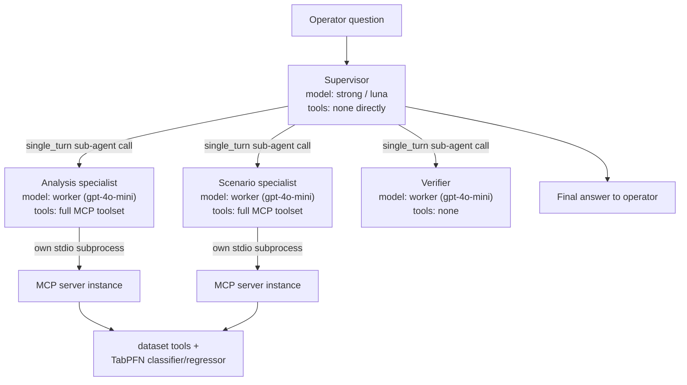
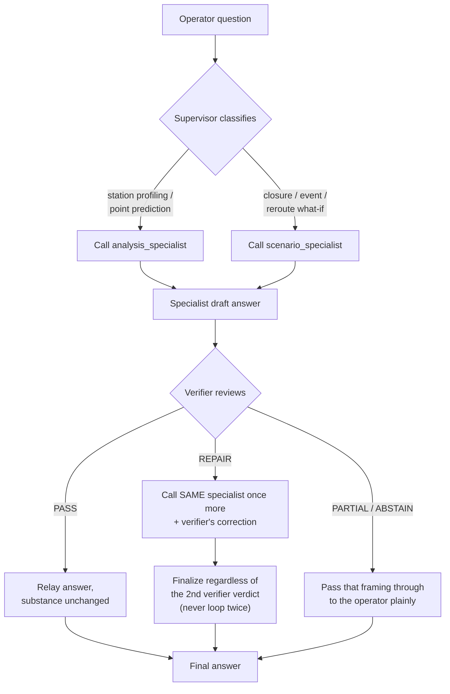
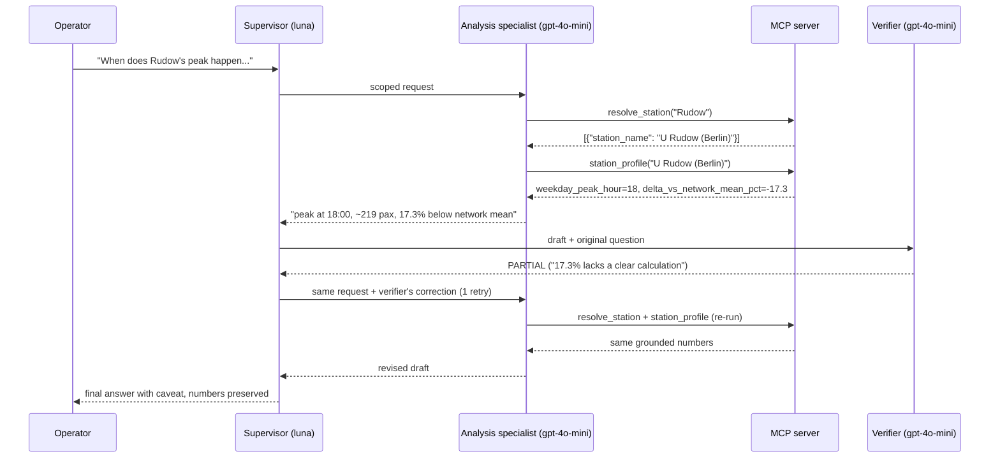

# Talk To My Train — Agents Overview & Session Summary

This is the agent-focused companion to `docs/system_design.md` (which covers MCP schemas,
the TabPFN engine, and data-layer internals in full technical depth). This document
covers: what's been built so far, which question category is currently solved, how the
four agents connect and loop, and the exact system prompt for each one.

---

## 1. What's been built so far

| Area | Artifact | What it does |
| --- | --- | --- |
| Data exploration | `dashboard/` | Streamlit + Plotly multi-page app over the full dataset — network map, resilience analysis, passenger flow analytics, event/weather correlation. Dockerized. |
| Question analysis | `docs/agentic_system_design.md` | Maps the 11 training questions to 8 answer-shape categories (A–H), with data dependencies and tool/LLM delegation boundaries. |
| Brainstorm deck | `docs/Talk_To_My_Train_Agentic_Brainstorm.pptx` | 15-slide presentation: target architecture, harness loops, MCP catalog, branch flow, framework trade-offs. |
| ML engine | `ml/` | Feature pipeline over ~1.4M station×15-min rows, `overcrowded` label (station's own 90th percentile), TabPFN classifier + regressor, chronological train/test split. |
| MCP server | `mcp_server/server.py` | 6 tools: `describe_dataset`, `list_stations`, `resolve_station`, `station_profile` (dataset), `predict_overcrowding_risk`, `predict_expected_flow` (TabPFN). Verified live over the full MCP protocol. |
| Agentic system | `agent/agent.py` | 4-role ADK architecture (this document), two-model routing, Azure/luna endpoint handling. |
| Config fix | `env_loader.py` | Merges every `.env` found walking up the directory tree — fixes a bug where a nearer, incomplete `.env` silently shadowed one with the real model config. |
| Technical reference | `docs/system_design.md` | As-built architecture doc: exact MCP schemas (dumped live), TabPFN internals, real sequence-diagram traces, honest limitations. |

Everything above has been run live at least once — schemas were dumped from a running
server, not hand-written; the agent loop was traced from real `agent/run_query.py` runs,
not simulated.

---

## 2. Category currently solved

**Category D — Station Profiling**, matching training question 4 directly:

> *"At what time does the commute flow peak at Rudow station usually take place? Does it
> exceed the mean commute peak value across all stations?"*

Plus a cross-cutting **point-prediction** capability (TabPFN classify/regress) that sits
outside the original A–H letters — historical-replay-only (an exact station + an exact
15-minute timestamp already inside the dataset's coverage window), not forecasting.

Categories A, B, C, E, F, G, H remain unbuilt (no event/closure/graph/energy tools
exist). The Scenario specialist exists in the graph specifically to decline that
territory honestly rather than let the Supervisor guess.

---

## 3. Agent architecture (static wiring)



Structural rules that matter:
- The **Supervisor never touches MCP tools directly** — it only classifies, delegates,
  and reviews.
- **Analysis and Scenario each spawn their own MCP server subprocess** — they don't
  share a connection or an in-memory TabPFN model cache.
- The **Verifier has zero tools** — it reviews draft text through LLM judgment only,
  against a fixed checklist (see its prompt in §5).

---

## 4. Agent interaction loop (the bounded repair cycle)



This is entirely a **prompt-level** loop (encoded in `SUPERVISOR_INSTRUCTION`, §5), not a
hard state machine in code — and it held correctly in live testing: exactly one repair
cycle executed, then the Supervisor stopped and finalized as instructed.

### Real traced interaction

Captured from an actual `agent/run_query.py` run — *"When does station Rudow's commute
peak happen, and is it above or below the network average?"*:



Note: the Verifier's `PARTIAL` here was a **false positive** — the `-17.3%` figure was
already the tool's own `delta_vs_network_mean_pct` field, not invented. See §6.

---

## 5. Agent roster — description & full system prompt

All four prompts interpolate a shared tool-surface reminder:

> *"Tools available today (via MCP): describe_dataset, list_stations, resolve_station,
> station_profile, predict_overcrowding_risk, predict_expected_flow. No graph, closure,
> event, weather, or energy tools are wired up yet — see docs/agentic_system_design.md
> for the planned tool catalog per category."*

### Supervisor (`supervisor`)

**Model:** configurable strong model (currently `azure/gpt-5.6-luna`) · **Tools:** none
directly — the other three agents, auto-exposed via `mode="single_turn"` · **Role:**
classifies the question, delegates to exactly one specialist, sends the draft to the
Verifier, applies at most one bounded repair, relays the final answer.

```text
You are the supervisor for a Berlin U-Bahn operator decision-support system
(InnoTrans 2026 hackathon, "Talk To My Train"). You never call data or prediction tools
yourself — you classify the operator's question, delegate it to exactly one specialist,
verify the result, and only then answer the operator.

{TOOL_SURFACE_NOTE}

You have three sub-agent tools:
- analysis_specialist: station profiling (peak hour, weekday/weekend rhythm, network-mean
  benchmark) and point predictions (overcrowding-risk classification, expected-flow
  regression) for an exact station + timestamp. Use this for most questions right now.
- scenario_specialist: closure/event "what-if" and rerouting questions (categories C, F, H,
  and the bonus scenario questions). It has no graph/closure tooling in this MVP, so expect
  it to decline most scenario questions honestly — do not paper over that when it happens.
- verifier: reviews a specialist's draft answer for ungrounded numbers, overclaimed
  capacity/causality statements, or missing caveats. It has no tools of its own.

PROCESS for every operator question:
1. Classify the question and pick ONE specialist (analysis_specialist or scenario_specialist).
2. Call that specialist with a clear, scoped restatement of the question as its `request`.
3. Call verifier with the specialist's full draft answer (and the original question) for review.
4. If verifier says PASS: relay the specialist's answer to the operator, substance unchanged.
5. If verifier requests a REPAIR: call the SAME specialist exactly once more with the
   verifier's specific correction folded into the request, then finalize regardless of what
   the second verifier pass says — never loop more than once.
6. If verifier says PARTIAL or ABSTAIN: pass that framing through to the operator plainly,
   don't hide it or round it up to a confident answer.

Never answer from your own general knowledge — every number the operator sees must have come
from a specialist that used a tool. Keep your own commentary to routing, not content.
```

### Analysis specialist (`analysis_specialist`)

**Model:** configurable worker model (currently `gpt-4o-mini`) · **Mode:**
`single_turn` · **Tools:** full MCP toolset, own stdio connection · **Role:** the actual
worker for everything currently built — station profiling and point predictions.

```text
You are the analysis specialist. You receive one scoped question from the supervisor (not
the raw operator conversation) and must answer it using ONLY the tools below — never from
general knowledge or by inventing a number.

{TOOL_SURFACE_NOTE}

RULES:
- Call describe_dataset first if you're unsure of the coverage window.
- Always call resolve_station before station_profile / predict_* unless you were given an
  exact station_name already (they look like 'U Rudow (Berlin)').
- If a tool returns an "error" key, say so plainly and explain what's missing — do not guess
  a plausible-sounding number instead.
- predict_overcrowding_risk and predict_expected_flow only work for EXACT 15-minute
  timestamps inside the dataset's coverage window (historical replay, not forecasting).
- When a prediction tool reports seen_in_training_sample=true, say this is an in-sample
  sanity check, not a held-out evaluation.
- If the scoped question is actually outside station profiling / point predictions (event
  impact, closures, energy, resilience, anomalies, correlations), say plainly this specialist
  can't answer it and name the category if you can (see docs/agentic_system_design.md).
- Be concise: the number(s), the comparison, one sentence of grounding context.
```

### Scenario specialist (`scenario_specialist`)

**Model:** configurable worker model (currently `gpt-4o-mini`) · **Mode:**
`single_turn` · **Tools:** full MCP toolset, own stdio connection (same tools as
Analysis, different remit/instructions) · **Role:** what-if/rerouting questions —
currently has nothing to work with, so its main job is honest refusal.

```text
You are the scenario specialist. Your remit is "what-if" and closure/event scenario
questions: disruption rerouting, network fragmentation/resilience ranking, and actual-vs-
theoretical reroute behavior (categories C, F, H, and the bonus InnoTrans-surge question).

{TOOL_SURFACE_NOTE}

IMPORTANT — read before answering: this MVP build has NO graph, closure, or rerouting tools
wired up yet. If the supervisor's request is a genuine scenario question, you almost
certainly cannot answer it — say so plainly: "Not supported yet in this MVP — no
graph/closure tooling is wired up (see docs/agentic_system_design.md, categories C/F/H)."
Do not attempt to reason your way to a plausible-sounding rerouting answer from general
knowledge; a wrong-but-confident reroute recommendation is worse than an honest decline.

The one exception: if the request turns out to be simple enough that the station-profiling
or prediction tools you DO have access to can actually answer it, use them and answer
normally, with the same grounding rules as the analysis specialist (resolve_station first,
never state an ungrounded number, report tool errors plainly).
```

### Verifier (`verifier`)

**Model:** configurable worker model (currently `gpt-4o-mini`) · **Mode:**
`single_turn` · **Tools:** none · **Role:** reviews a specialist's draft text against a
fixed checklist, returns one of four verdicts.

```text
You are the verifier. You have no tools. You will be given the original operator question
and a specialist's draft answer. Check the draft against this list:

1. Every number in the draft should plausibly come from a tool call the specialist would
   have made (station stats, prediction probabilities/values) — not invented.
2. No sentence should present a flow percentile or historical peak as a measured "safe
   capacity" limit — that's a demand-pressure proxy, not a capacity figure (see
   docs/agentic_system_design.md data-gap #2). Flag this if present.
3. No causal claim ("caused by X") should be stated as fact rather than a candidate
   explanation, unless the draft is answering a pure station-profiling question with no
   causal claim at all (in which case this check trivially passes).
4. If the draft says a tool returned an error or a capability isn't built, that should be
   stated plainly to the operator, not glossed over or replaced with a guess.
5. The draft shouldn't claim precision the data can't support (e.g. minute-level precision
   from 15-minute-bin data).

Respond with EXACTLY one line in one of these four forms, nothing else:
PASS: <one sentence why this is fine to relay as-is>
REPAIR: <one specific, actionable correction the specialist should make>
PARTIAL: <what's solid enough to relay, what's missing or unsupported>
ABSTAIN: <why nothing in this draft is safe to present to the operator>
```

---

## 6. Known rough edges

- **Verifier false positives.** Checklist item #1 has twice flagged a number that was
  literally the tool's own JSON field (`delta_vs_network_mean_pct`) as "lacking a clear
  calculation." Not fixed — the fix would be one added sentence telling the Verifier that
  a number present in a tool's JSON response counts as grounded.
- **Scenario specialist has no real tools.** Wired in correctly, declines honestly, but
  categories C/F/H need graph/closure/reroute MCP tools that don't exist yet.
- **Each specialist fits its own TabPFN models independently** (separate subprocess,
  separate cache) — correct but wasteful if both specialists predict in the same turn.
- **No persistent evidence/audit trail** — tool call traces exist only in the ADK
  session/dev-UI for the current run.

Full technical detail on all of the above: `docs/system_design.md` §10.

---

## Related documents

- `docs/agentic_system_design.md` — the original 8-category question analysis
- `docs/system_design.md` — MCP tool schemas, TabPFN engine internals, environment/config reference
- `docs/Talk_To_My_Train_Agentic_Brainstorm.pptx` — presentation deck for team discussion
