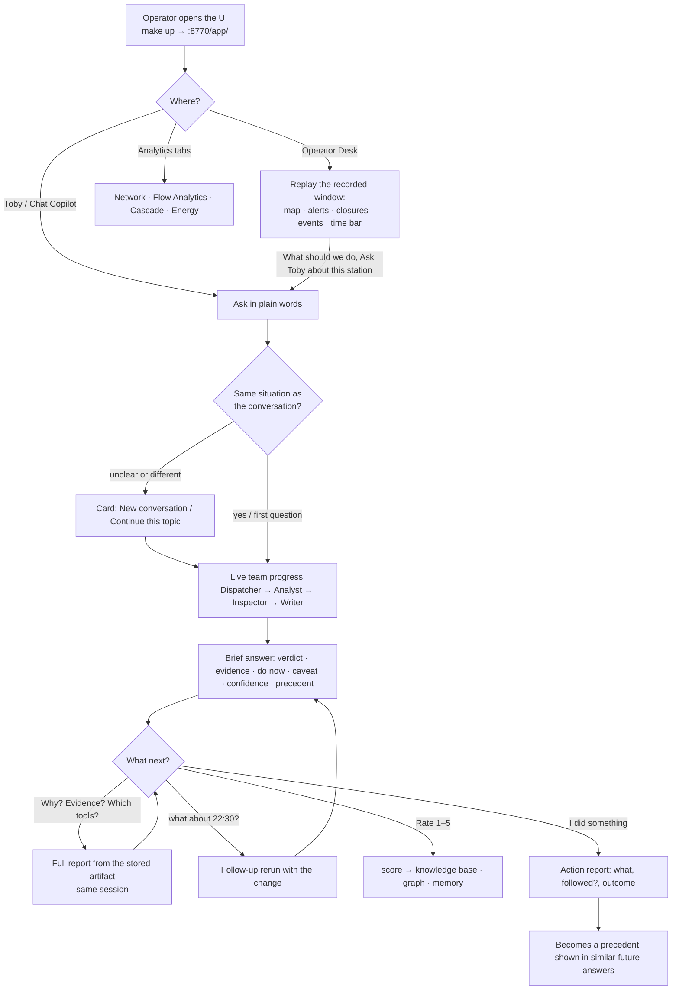
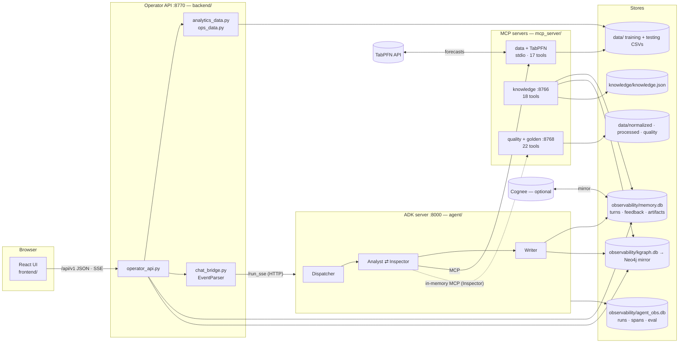
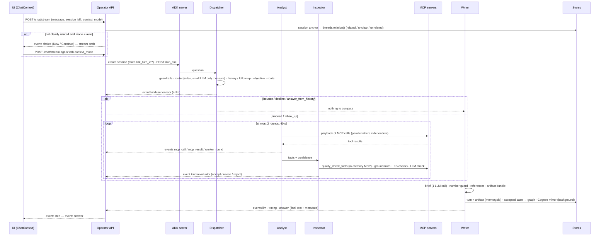
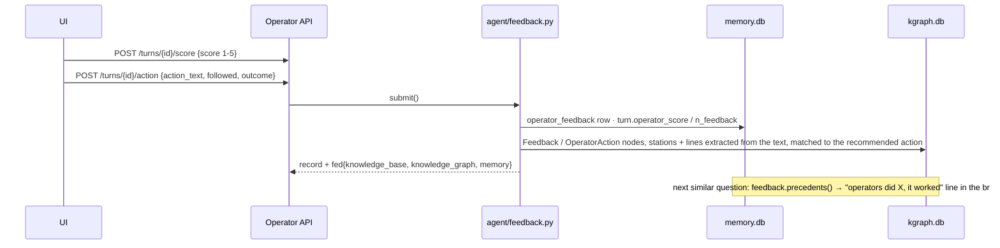

# User flow, data flow and events

What happens between an operator's keystroke and the answer on the screen, what is stored where, and which events / spans are emitted on the way. Diagrams are Mermaid (rendered by GitHub and most Markdown viewers).

## 1. User flow (operator)

Rules that shape the flow: one conversation = one situation (topic-switch card instead of silently mixing topics) · brief by default, full report only on request · advisory only, the operator decides · an answer rated 1–2 is no longer reused · a situation that asked for an action and has no action report counts on Toby's badge.

## 2. System context and data flow

* **Read path** (analytics tabs, desk): UI → operator API → `analytics_data` / `ops_data` → the merged raw CSVs (training + testing split). No agent involved.
* **Ask path** (chat): UI → operator API → ADK server → tools → answer; stored on the way out.
* **Learn path** (feedback): UI → operator API → knowledge base + graph (+ memory) → precedents in later answers.
* **Build path** (offline, `make up` does the missing steps once): raw CSVs → `ml/nextmove_pipeline` → `data/normalized` → `ml/quality_db.py` → `data/quality`; raw CSVs → `agent/knowledge_build.py` → `knowledge/knowledge.json`; `agent/kgraph_build.py` → `observability/kgraph.db`.

## 3. Sequence of one chat turn

## 4. Feedback loop

## 5. What the ADK server emits — events

The pipeline is a `SequentialAgent` of three ADK agents (`agent/fast_agent.py`): **`dispatcher`**, **`analyst`** (contains the Analyst ⇄ Inspector loop), **`writer`**. Each step yields ADK `Event`s. The operator API reads them from `/run_sse`; `customMetadata.kind` says what an event is. `EventParser.feed()` (`backend/chat_bridge.py`) turns them into operations-log steps and, at the end, the response object.

| `customMetadata.kind` | Author | Emitted | Key metadata | UI step |
| --- | --- | --- | --- | --- |
| `llm` | dispatcher / analyst / writer | every LLM inference (router fallback, Inspector, Writer) | `role`, `model`, `inference_s`, `tok_in`, `tok_out`, `error`, `prompt`, `response` | `kind: llm`, stage by role (writer → writer, evaluator → inspector, else dispatcher) |
| `supervisor` | dispatcher | once, after the plan | `decision` (proceed · answer_from_history · follow_up · decline · need_input · bounce), `category`, `tier`, `route` {specialist, mcp_servers, datasets, tools, ml_engine}, `route_ms`, `seconds` | `route`, stage `dispatcher` |
| *(function call)* + `mcp_call` | analyst | a tool call starts | `server`, `round`, `started_at_ms`; ADK `functionCall` {id, name, args} | — (paired with the result) |
| *(function response)* + `mcp_result` | analyst | a tool call ends | `seconds`, `started_at_ms`; ADK `functionResponse` {ok, result_bytes, result_preview, wait_ready_ms, server} | `tool`, stage `analyst` |
| `worker_round` | analyst | end of an Analyst round | `round`, `seconds`, `tools[]`, `confidence`, `status`, `engine` | `worker`, stage `analyst` |
| `evaluator` | analyst | end of an Inspector round | `round`, `verdict` (accept · revise · reject), `score`, `issues[]`, `model`, `seconds` | `evaluator`, stage `inspector` |
| `facts` | analyst | the facts are final | `seconds` (tools_s), `mcp_s`, `rounds` | — |
| `timing` | writer | before the answer | `supervisor_s`, `worker_evaluator_s`, `mcp_s`, `writer_s`, `writer_llm_s`, `total_s` | fills `timing` |
| `answer` | writer | last event | `source` (worker · follow_up · history · decline · safe_fallback), `answer_mode` (brief · detail), `answer_words`, `turn_id`, `artifact_turn_id`, `requires_action`, `precedent`, `guard`, `model`, `tok_in`, `tok_out` + the timing parts | `writer`, stage `writer`; final text = the answer |

Steps that are skipped simply do not appear: a bounced question emits `supervisor` and `answer` only; an answer from history has no tool events.

**Session state** (`ctx.session.state`, ADK) carries the hand-over between the three agents: `plan` / `sp` (the `SupervisorPlan`), `timing`, `t_start`, `facts`, `result` (`WorkerResult`), `verdict` (`EvaluatorVerdict`), and, for follow-ups, `last_plan`, `last_facts`, `last_artifact`, `situation`, and `link_turn_id` (set when a conversation is resumed).

## 6. Traces — OpenTelemetry spans (`observability/agent_obs.db`, table `spans`)

ADK's own spans (`invocation`, `invoke_agent <name>`) plus manual ones for what ADK cannot see:

| Span | Stage | Attributes (`tmt.*`) |
| --- | --- | --- |
| `dispatcher.plan` | Dispatcher | `router`, `category`, `confidence`, `decision`, `guardrails_failed`, `question`, `objective`, `route`, `entities`, `follow_up`, `history`, `plan` |
| `route.rules`, `llm.route`, `guardrails.input`, `history.lookup` | Dispatcher | rule tier / fallback model call / guard results / history hit |
| `analyst.loop` → `analyst.execute` → **`mcp.tool <name>`** | Analyst | `category`, `tools`, `ml_engine`, `iterations`, `verdict`, `confidence`; per tool: arguments, seconds, bytes, ok |
| `analyst_inspector.round` | loop | `iteration`, `overrides`, `verdict` |
| `inspector.check`, `inspector.quality_mcp`, `inspector.llm` | Inspector | deterministic checks, the quality MCP call, the LLM check (`model`, `prompt_chars`) |
| `llm.write`, `writer.references`, `guard.check` | Writer | model, tokens, references, number-guard result |
| `kb.sanity`, `kg.record_case` | after the answer | sanity checks / evidence, actions and options written to the graph, Neo4j mirror flag |

Every question is also one row in `runs` (question, answer, category, decision, timings, tokens, `events_json`, `plan_json`, `facts_json`, `timing_json`). The dashboard's *Observability* page and `scripts/tasks.py` reports read these tables; schema in [`data_schema.md`](data_schema.md) §4.

## 7. What is stored, when

| Moment | Written to |
| --- | --- |
| a question is answered (`source = worker`) | `memory.db.turns` (answer, facts, plan, sanity, verdict, confidence, `accepted`, **artifact bundle**) · if accepted: `kgraph.db` (Problem / Situation / Answer / Action / Option / Conversation / Artifact nodes) · Cognee (background, only if enabled) · `agent_obs.db.runs` + `spans` |
| an answer is reused from history | a `turns` row with `source: history` so it appears in the conversation and anchors the situation; nothing recomputed |
| the operator asks *why / evidence / tools* | the full report is generated once and stored in the artifact (`turns.artifact_json.report`), indexed on the graph Artifact node |
| score / action | `memory.db.operator_feedback`, `turns.operator_score`, graph Feedback / OperatorAction nodes |
| offline runs (`evaluation/…`) | `agent_obs.db.eval_*`, `submissions.db`, `evaluation/submissions/<run>.json` |

## 8. Timing you can expect

Dispatcher ≈ 1–10 ms (rules) · Analyst ≈ 0.3–3 s per playbook (first call after a cold start ~30 s while TabPFN warms) · Inspector ≈ ms (deterministic + in-memory MCP) + one LLM check when memory is on · Writer ≈ 2–4 s (one LLM call). A repeated accepted question from history: 0 s. Measured runs: [`latency_optimization.md`](latency_optimization.md), [`submission_run_report.md`](submission_run_report.md).
