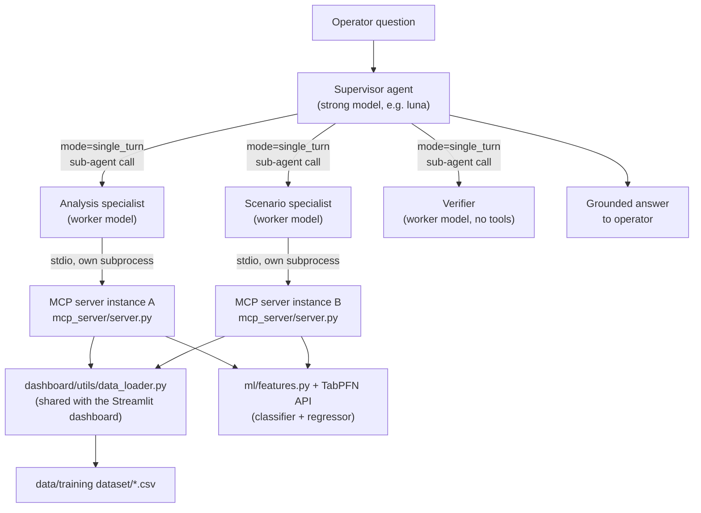
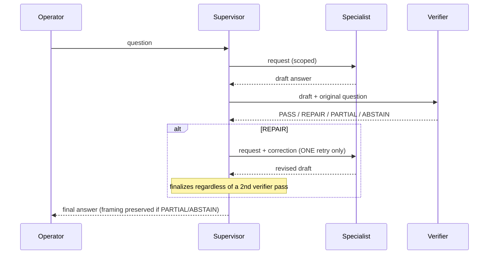
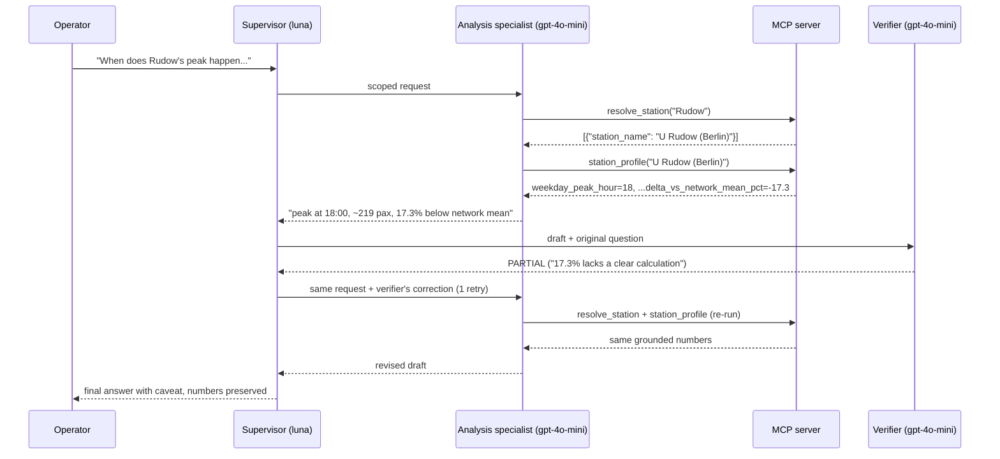
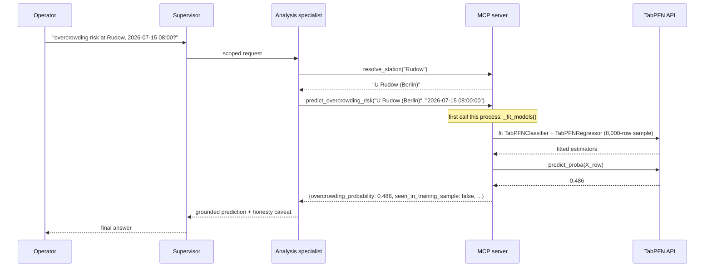

# Talk To My Train — System Design & Agentic Architecture (As-Built)

This is the technical reference for what's actually implemented in this repository —
not the aspirational blueprint. Two companion documents cover different ground:

| Document | Covers |
| --- | --- |
| `docs/agentic_system_design.md` | Question-category analysis (A–H) and the *planned* tool catalog, written before implementation started |
| `Talk_To_My_Train_Engineering_Blueprint.md` (NextMove repo) | The full target architecture proposal (LangGraph, DuckDB, Langfuse, evidence receipts, evaluation gates) |
| **This document** | What is actually built right now: the MCP server's real tools and schemas, the TabPFN inference engine, the 4-agent ADK wiring, and the real data flow — verified against the live code, not recalled from memory |

Everything below was checked against the running code on 2026-09-23: tool schemas were
dumped from a live `FastMCP` server instance, not hand-transcribed.

---

## 1. Scope of what's built

| Capability | Status |
| --- | --- |
| Category D — station profiling (peak hour, weekday/weekend rhythm, network-mean benchmark) | ✅ Built |
| TabPFN overcrowding-risk classification (point prediction) | ✅ Built |
| TabPFN expected-flow regression (point prediction) | ✅ Built |
| 4-role agentic architecture (Supervisor / Analysis / Scenario / Verifier) | ✅ Built |
| Two-model routing (strong model for Supervisor, lighter model for specialists) | ✅ Built |
| Categories A, B, C, E, F, G, H (event impact, anomalies, disruption reroute, energy, resilience, correlation, reroute behavior) | ❌ Not built — no graph/closure/event/energy tools exist yet |

The Scenario specialist exists in the agent graph and is correctly instructed to decline
scenario questions honestly, precisely because none of categories C/F/H have real tools
behind them yet. This is a deliberate scope boundary, not an oversight.

---

## 2. High-level architecture



Key structural facts:

- **Supervisor never calls MCP tools directly.** It only classifies, delegates, and
  reviews. All data access happens inside a specialist's own turn.
- **Each specialist owns an independent MCP connection.** `_build_mcp_toolset()` in
  `agent/agent.py` is called once per specialist agent, so Analysis and Scenario each
  spawn their own `mcp_server/server.py` subprocess over stdio — they do not share a
  server process or its in-memory caches.
- **The Verifier has no tools at all.** It reviews the specialist's draft text purely
  through LLM judgment against a fixed checklist — there is no evidence-receipt system
  yet (see §10).

---

## 3. Data layer

### 3.1 Source datasets

Full schema in `data/dataset_schema.md`. Summary of what feeds the system:

| File | Rows (approx.) | Used by |
| --- | --- | --- |
| `stations_with_ubahn.csv` | 168 | station metadata, line membership |
| `berlin_ubahn_connections.csv` | 182 | graph edges (not yet used by any MCP tool) |
| `flows_pre_innotrans.csv` | 8,320 timestamps × 168 stations | the core `passengers` series |
| `weather_data_pre_innotrans.csv` | 8,320 | weather features |
| `berlin_events_summer_2026_pre_innotrans.csv` | 417 | event-count/attendance features (city-wide daily proxy) |
| `closures_pre_innotrans.csv` | 26 | closure-window features |
| `energy_consumption_pre_innotrans.csv` | 104 | not yet used by any MCP tool |

### 3.2 `dashboard/utils/data_loader.py` — the shared data core

Every MCP tool and the ML feature pipeline reads through this module, not the raw CSVs
directly. This is deliberate: the Streamlit dashboard, the MCP server, and the ML
pipeline all share one parsing/joining implementation, so they cannot silently disagree
about how a timestamp, a closure window, or a station name is interpreted.

Functions consumed downstream (by `mcp_server/server.py` and `ml/features.py`):

| Function | Returns |
| --- | --- |
| `discover_dataset_dirs(base_dir)` | `{label: Path}` — every dataset folder found (supports switching to the InnoTrans eval dataset later without code changes) |
| `load_stations(folder)` | DataFrame: `station_id, station_name, longitude, latitude, u_bahn_lines, primary_line, n_lines, is_interchange` |
| `flows_long(folder)` | Melted flows: `timestamp, station_name, passengers, date, hour, dow, dow_name, is_weekend` (one row per station per 15-min timestamp — ~1.4M rows) |
| `station_avg_flow(folder)` | Per-station: `avg_15min_passengers, total_passengers, avg_daily_passengers, peak_15min_passengers` |
| `hourly_profile(folder, station_names=None)` | `hour, is_weekend, passengers` — mean flow by hour-of-day, optionally filtered to specific stations |
| `load_weather(folder)` / `load_events(folder)` / `load_closures(folder)` | Parsed weather / events / closures (closures pre-parsed into `closure_type`, `affected_line`, `affected_segment`, `when`, `end`) |

---

## 4. ML engine — TabPFN inference

### 4.1 Feature engineering (`ml/features.py`)

`build_feature_table(folder)` produces one row per **(station, 15-minute timestamp)** —
~1.4M rows across the training window — with two targets and 17 features:

**Targets**
| Column | Definition |
| --- | --- |
| `overcrowded` | 1 if `passengers` ≥ that station's own historical 90th percentile, else 0. No platform-capacity figure exists in the source data, so this is a *relative demand-pressure* label, not a measured safe-capacity threshold — see the honesty-boundary note in §10. |
| `passengers` | Raw flow count — doubles as the regression target for `predict_expected_flow` |

**`FEATURE_COLUMNS`** (exact list, from source):
| Feature | Source | Notes |
| --- | --- | --- |
| `hour`, `dow`, `is_weekend`, `month` | timestamp | temporal context |
| `station_avg_passengers`, `n_lines`, `is_interchange`, `primary_line` | station metadata | `primary_line` is the only categorical column (`CATEGORICAL_COLUMNS`) |
| `temp`, `prcp`, `wspd`, `cldc`, `coco` | weather, joined on exact timestamp | |
| `daily_event_count`, `daily_event_attendance` | events, joined on date | city-wide proxy — events aren't geocoded to a station in the source data |
| `in_closure` | closures, vectorized window/line match | approximate for line suspensions (flags every station on the line, not just the closed segment) |
| `network_active_closures` | closures | count of concurrent closures network-wide, regardless of relevance to this station |

A real data quirk handled here: `stations_with_ubahn.csv` models some interchange
stations (e.g. *"U Stadtmitte (Berlin)"*) as **one row per line**, sharing the same
`station_name` — but `flows.csv` has only one column per physical station. A naive merge
on `station_name` would silently duplicate that station's rows. `build_feature_table()`
collapses station metadata to one row per name before joining, and drops the one
unresolvable pandas-auto-renamed duplicate column (`"...Berlin).1"`) rather than guessing
its line membership.

`encode_categoricals(df, reference=None)` label-encodes `primary_line`. The `reference`
parameter matters for live inference: a single-row prediction frame must be encoded
against the *training sample's* category set, not its own (a 1-row frame has only one
category, so `.astype("category")` on it alone would assign incompatible codes).

### 4.2 Offline training & evaluation (`ml/train_overcrowding_classifier.py`)

TabPFN is an in-context tabular foundation model — designed for thousands of rows, not
the ~1.4M in the full feature table — so this script samples rather than feeding
everything in:

1. **Chronological split** (`chronological_split`): the last 20% of *days* (by date, not
   by row) become the held-out test pool. This matters because consecutive 15-minute
   bins are highly autocorrelated — a random row-level split would leak near-duplicate
   information across train/test.
2. **Stratified subsample** (`stratified_subsample`): 8,000 train rows / 2,000 test rows,
   each oversampling the positive (`overcrowded`) class to at least 15% so TabPFN sees a
   usable minority-class signal.
3. **Fit**: `TabPFNClassifier(model_path="v3.5_default", categorical_features_indices=[...])`
   on the encoded 8,000-row sample.
4. **Evaluate**: classification report, ROC-AUC, PR-AUC, confusion matrix on the
   chronologically-held-out 2,000-row test sample. Predictions written to
   `ml/output/overcrowding_predictions.csv`.

**Real result from the last run** (kept for reference, not re-run every time this doc is
read): ROC-AUC 0.86, PR-AUC 0.446 — the model has real discriminative signal — but at the
default 0.5 decision threshold it predicted "normal" for all 2,000 test rows (0 recall on
the minority class). The threshold is miscalibrated for a 15%-positive problem; this is
flagged, not fixed, in the codebase (see §10).

### 4.3 Live inference inside the MCP server (`_fit_models()`)

`predict_overcrowding_risk` and `predict_expected_flow` don't call the offline script —
they fit their own models **once per server process**, lazily, on first prediction
request:

```
_fit_models():
  1. Require TABPFN_API_TOKEN (env var) — raises RuntimeError, caught and returned
     as {"error": ...} by both predict_* tools, never an unhandled exception.
  2. Recompute the SAME chronological train-pool date cutoff as the offline script
     (_get_train_pool_dates: last 20% of days held out).
  3. Draw the SAME stratified 8,000-row sample strategy from that train pool.
  4. Fit ONE TabPFNClassifier (target: overcrowded) AND ONE TabPFNRegressor
     (target: passengers) on that sample — sharing the same X to avoid encoding twice.
  5. Cache classifier, regressor, train_sample, and cutoff_date in _model_cache
     (module-level dict) for the lifetime of the process.
```

Because each specialist agent spawns its **own** `mcp_server/server.py` subprocess (see
§2), each subprocess fits its own copy of these models independently — a minor
inefficiency (double API quota use if both specialists predict in one turn), not a
correctness issue.

**Leakage transparency** — every prediction reports `seen_in_training_sample`, computed
by `_seen_in_training_sample()`: an *exact* (station, timestamp) row-membership check
against the fitted 8,000-row sample, not just a pre/post-cutoff date check. A row can be
chronologically pre-cutoff and still correctly report `false` if it simply wasn't drawn
into the stratified sample. Both `agent/agent.py`'s specialist instructions and the
Verifier's checklist require this flag to be surfaced to the operator, not silently
dropped.

---

### 4.4 Category C — TabPFN demand baseline (`ml/demand_baseline.py`, `ml/scenario.py`)

Regression counterpart to the overcrowding classifier: `TabPFNRegressor` with
`output_type="quantiles"` + `"mean"` predicts each station's counterfactual demand
distribution per 15-min slot, trained on a 10k-row sample of non-closure rows with leak-safe
profile features. Held-out MAE 74.6 (vs 77.9 profile-mean baseline), 80/90/95 % interval coverage
78.6/89.7/94.8 %. `scenario.run_scenario` layers explicit redistribution assumptions on top and
returns per-station P(> own p95). Full method, numbers, and the 26-closure case study:
`docs/disruption_case_study.md`. Train/evaluate: `make train-disruption`.

MCP tools (`mcp_server/disruption_tools.py`, registered on the same server):
`resolve_closure`, `apply_closure`, `alternate_paths`, `scenario_flow`. After the first
`scenario_flow` call per process the TabPFN model is fitted once and cached.

## 5. MCP server (`mcp_server/server.py`)

FastMCP server, stdio transport, one instance spawned per specialist agent. Six tools,
two categories:

| Tool | Category | Reads/writes | TabPFN? |
| --- | --- | --- | --- |
| `describe_dataset` | Dataset | `data_loader.load_stations`, feature table | No |
| `list_stations` | Dataset | `data_loader.load_stations` | No |
| `resolve_station` | Dataset | `data_loader.load_stations` (fuzzy match) | No |
| `station_profile` | Dataset | `data_loader.station_avg_flow`, `hourly_profile` | No |
| `predict_overcrowding_risk` | ML inference | feature table row lookup | **Yes** — `TabPFNClassifier` |
| `predict_expected_flow` | ML inference | feature table row lookup | **Yes** — `TabPFNRegressor` |

All six are read-only with respect to the source data (no tool writes to the dataset);
the two prediction tools have a side effect the first time they're called per process —
fitting and caching the TabPFN models — but that's in-memory only.

### 5.1 Full tool schemas (dumped live via `mcp.list_tools()`)

**`describe_dataset()`** — no parameters.
```json
{"parameters": {"type": "object", "properties": {}, "additionalProperties": false},
 "output_schema": {"type": "object", "additionalProperties": true}}
```
Returns: `dataset_folder, coverage_start, coverage_end, n_stations, n_lines, supported_categories[], not_yet_supported`.

**`list_stations()`** — no parameters.
```json
{"parameters": {"type": "object", "properties": {}, "additionalProperties": false},
 "output_schema": {"type": "object", "required": ["result"],
   "properties": {"result": {"type": "array", "items": {"type": "object", "additionalProperties": true}}},
   "x-fastmcp-wrap-result": true}}
```
Returns a list of `{station_name, u_bahn_lines}`.

**`resolve_station(query: str, max_results: int = 5)`**
```json
{"parameters": {"type": "object", "required": ["query"],
   "properties": {"query": {"type": "string"}, "max_results": {"type": "integer", "default": 5}},
   "additionalProperties": false},
 "output_schema": {"type": "object", "required": ["result"],
   "properties": {"result": {"type": "array", "items": {"type": "object", "additionalProperties": true}}},
   "x-fastmcp-wrap-result": true}}
```
Returns substring matches first, then `difflib` closest-spelling matches, deduplicated,
most likely first: `[{"station_name": "U Rudow (Berlin)"}, ...]`. If nothing matches:
`[{"station_name": null, "note": "No station resembling '<query>' found."}]`.

**`station_profile(station_name: str)`**
```json
{"parameters": {"type": "object", "required": ["station_name"],
   "properties": {"station_name": {"type": "string"}}, "additionalProperties": false},
 "output_schema": {"type": "object", "additionalProperties": true}}
```
Returns (real example, `U Rudow (Berlin)`):
```json
{
  "station_name": "U Rudow (Berlin)",
  "avg_daily_passengers": 6814.27,
  "weekday_peak_hour": 18,
  "weekday_peak_avg_passengers": 218.84,
  "weekend_peak_hour": 8,
  "weekend_peak_avg_passengers": 146.13,
  "network_mean_weekday_peak_passengers": 264.66,
  "exceeds_network_mean_weekday_peak": false,
  "delta_vs_network_mean_pct": -17.3,
  "method": "hour-of-day average across the full dataset window, weekday vs weekend split",
  "evidence": {"dataset_folder": "data/training dataset", "tool": "flows.station_profile"}
}
```
or `{"error": "Unknown station_name '<name>'. Call resolve_station first."}`.

**`predict_overcrowding_risk(station_name: str, timestamp: str)`**
```json
{"parameters": {"type": "object", "required": ["station_name", "timestamp"],
   "properties": {"station_name": {"type": "string"}, "timestamp": {"type": "string"}},
   "additionalProperties": false},
 "output_schema": {"type": "object", "additionalProperties": true}}
```
Returns:
```json
{
  "station_name": "...", "timestamp": "...",
  "overcrowding_probability": 0.486,
  "predicted_label": "normal", "actual_label": "overcrowded",
  "actual_passengers": 326,
  "data_mode": "historical_replay",
  "seen_in_training_sample": false,
  "evaluation_note": "...",
  "model": "TabPFNClassifier(v3.5_default)"
}
```
or `{"error": "No data for station_name=... at timestamp=..."}` / `{"error": "TABPFN_API_TOKEN not set..."}`.

**`predict_expected_flow(station_name: str, timestamp: str)`** — same input schema as
above. Returns `predicted_passengers, actual_passengers, absolute_error,
seen_in_training_sample, evaluation_note, model: "TabPFNRegressor(v3.5_default)"`.

### 5.2 Timestamp/coverage constraint

Both prediction tools only accept **exact 15-minute marks inside the dataset's coverage
window** (`_lookup_query_row` does an exact-equality lookup against the feature table,
not a nearest-match). This is explicit historical replay, not forecasting — asking about
a timestamp outside the window returns a structured error, never a fabricated number.

---

## 6. Agentic design (`agent/agent.py`)

### 6.1 The four roles

| Role | Model | Tools | Behavior |
| --- | --- | --- | --- |
| **Supervisor** (`supervisor`) | Configurable, typically the strong/"luna" model | None directly — 3 sub-agents exposed as tools | Classifies the question, delegates to exactly one specialist, sends the draft to the Verifier, applies at most one bounded repair, relays the final answer |
| **Analysis specialist** (`analysis_specialist`) | Worker model | Full MCP toolset (own connection) | Station profiling + predictions; declines anything outside that scope, naming the category if it can |
| **Scenario specialist** (`scenario_specialist`) | Worker model | Full MCP toolset (own connection) | Instructed remit: closure/event/reroute "what-if" questions — but since no graph/closure tools exist, it's explicitly told to decline those honestly rather than reason from general knowledge |
| **Verifier** (`verifier`) | Worker model | None | Reviews a specialist's draft text against a 5-point checklist; responds `PASS` / `REPAIR` / `PARTIAL` / `ABSTAIN` |

### 6.2 ADK wiring mechanics

Each specialist and the Verifier is built as an `Agent(..., mode="single_turn")` and
attached to the Supervisor via `sub_agents=[...]`. ADK auto-wraps every `single_turn`
sub-agent as a callable tool on its parent (`_SingleTurnAgentTool`, internal to
`google.adk.agents.llm_agent`) — the tool takes one `request: str` parameter (no custom
input schema is defined here) and returns the sub-agent's final text output. Critically,
this runs the sub-agent **inline** in the Supervisor's own turn/session, so the
Supervisor keeps control and can chain further tool calls (like the Verifier) afterward —
unlike ADK's alternative `mode="chat"` transfer mechanism, which would hand off the whole
conversation.

This is ADK's currently-recommended pattern for this shape (its own `AgentTool` class
docstring marks direct `AgentTool` wrapping as discouraged in favor of `mode="single_turn"`
+ `sub_agents`).

### 6.3 Bounded repair loop

Encoded entirely in `SUPERVISOR_INSTRUCTION` (prompt-level, not a hard state-machine
constraint in code):



Verified live: this loop correctly executed exactly one repair cycle and then stopped
(see the transcript in §7.1) — the "never loop more than once" instruction held.

### 6.4 Two-model configuration

`_build_model(role)` — `role` is `"SUPERVISOR"` or `"WORKER"`:

```
{role}_LITELLM_MODEL  →  WORKER_LITELLM_MODEL  →  ADK_LITELLM_MODEL  →  ADK_MODEL (default "gemini-2.5-flash")
```

Each step falls back to the next only if the previous is unset — so an unconfigured
`SUPERVISOR_*` role transparently inherits whatever `WORKER_*`/`ADK_*` is already
working, and the system degrades to a single-model setup rather than failing outright.

**Azure OpenAI/Foundry auto-correction** — added after debugging the real "luna" endpoint
live. If `{role}_API_BASE`'s host contains `azure.com`:
- `api_version` is extracted from the URL's query string automatically (if
  `{role}_API_VERSION` isn't set explicitly) — Azure portals often hand out a URL with
  `?api-version=...` embedded, but LiteLLM wants it as a separate parameter.
- `api_base` is trimmed to scheme + host only — a full URL with a path (e.g.
  `.../openai/responses?api-version=...`) breaks LiteLLM's own path construction, which
  appends its own suffix on top.
- The model prefix is coerced to `azure/` if it isn't already — a plain `openai/<name>`
  string pointed at an Azure host 404s, because LiteLLM's `azure/` adapter is what
  actually knows how to build the Azure-specific request path.

All three corrections were verified against the real endpoint via isolated `litellm.completion()`
/ `litellm.responses()` calls before being encoded here — see git history / session notes,
not re-derived from documentation guesses.

### 6.5 Environment variable reference

| Variable | Read by | Purpose |
| --- | --- | --- |
| `TABPFN_API_TOKEN` | `mcp_server/server.py` | TabPFN API auth (both predict tools) |
| `SUPERVISOR_LITELLM_MODEL` | `agent/agent.py` | Supervisor's model (LiteLLM string, e.g. `azure/gpt-5.6-luna`) |
| `SUPERVISOR_API_BASE` / `SUPERVISOR_API_KEY` / `SUPERVISOR_API_VERSION` | `agent/agent.py` | Supervisor's endpoint credentials (Azure auto-corrected, see §6.4) |
| `WORKER_LITELLM_MODEL` | `agent/agent.py` | Model for Analysis/Scenario/Verifier (e.g. `gpt-4o-mini`) |
| `WORKER_API_BASE` / `WORKER_API_KEY` / `WORKER_API_VERSION` | `agent/agent.py` | Worker endpoint credentials, same rules as Supervisor |
| `ADK_LITELLM_MODEL` | `agent/agent.py` | Fallback LiteLLM model if a role-specific one isn't set |
| `ADK_MODEL` | `agent/agent.py` | Last-resort native-ADK model string (default `gemini-2.5-flash`, needs `GOOGLE_API_KEY`) |
| `OPENAI_API_KEY` | LiteLLM (implicitly, via its own env conventions) | Auth for any plain `openai/...` model string |
| `DATA_DIR` | `dashboard/utils/data_loader.py` | Override the dataset folder (defaults to `data/`) |

**`.env` discovery** (`env_loader.py`): walks from the current working directory upward
through every parent, loading **every** `.env` file found (not just the nearest), nearest
file's values winning on key conflicts. This repo has secrets split across two `.env`
files at different directory levels — this loader is why a script run from anywhere in
the tree still sees all of them, rather than only whichever `.env` happens to be nearest.

---

## 7. End-to-end data flow (real traces)

### 7.1 Station-profiling question

Question: *"When does station Rudow's commute peak happen, and is it above or below the
network average?"* — this is the actual sequence observed running
`agent/run_query.py`:



Note the Verifier's `PARTIAL` here was a **false positive** — the `-17.3%` figure was
already the tool's own `delta_vs_network_mean_pct` field, not an invented number. This is
a known rough edge (see §10), not a masked failure: the Supervisor's bounded-repair
instruction correctly limited the damage to one extra round-trip rather than looping.

### 7.2 Prediction question



---

## 8. How to run

```
make install-mcp      # mcp_server/requirements.txt
make install-agent    # agent/requirements.txt (google-adk, mcp, litellm)
make mcp-server        # run the MCP server standalone (stdio) for manual testing
make agent-web         # ADK dev UI — visualize the conversation + every tool call
make agent-cli          # interactive terminal chat
make agent-query Q="..." # one-shot, plain-text answer
```

`agent-web`/`agent-cli`/`agent-query` all import `agent/agent.py`'s `root_agent`
(the Supervisor), so the full 4-role chain runs identically regardless of entry point.

---

## 9. Repository map (agentic system only)

| Path | Role |
| --- | --- |
| `env_loader.py` | Shared multi-`.env` merge loader |
| `agent/agent.py` | Supervisor + 3 sub-agents, model routing, ADK wiring |
| `agent/run_query.py` | CLI entry point (`Runner` + `InMemorySessionService`) |
| `mcp_server/server.py` | The 6 MCP tools, TabPFN lazy-fit/cache |
| `ml/features.py` | Shared feature table + label definition (`build_feature_table`, `FEATURE_COLUMNS`) |
| `ml/train_overcrowding_classifier.py` | Offline training/eval script (same split logic the MCP server mirrors) |
| `dashboard/utils/data_loader.py` | Shared data-loading core (also used by the Streamlit dashboard) |

---

## 10. Known limitations / honest boundaries

Carried forward from `docs/agentic_system_design.md`, plus what testing surfaced:

1. **`overcrowded` is a relative demand-pressure label, not a capacity limit.** No
   platform-capacity figure exists anywhere in the source schema.
2. **Event/closure context in the ML features is a coarse proxy.** `daily_event_count`
   is city-wide, not station-specific (events aren't geocoded in the source data);
   `in_closure` flags every station on a suspended line, not just the closed segment.
3. **The Scenario specialist has no real tools.** It's wired into the architecture and
   correctly declines, but categories C/F/H need graph/closure/reroute MCP tools that
   don't exist yet.
4. **The Verifier has no evidence-receipt system to check against** — it reviews the
   specialist's free-text draft via LLM judgment only, which produces occasional false
   positives (see §7.1: a real tool-sourced number was incorrectly flagged as
   "lacking a clear calculation"). Tightening `VERIFIER_INSTRUCTION` to explicitly treat
   numbers appearing in a tool's JSON response as grounded would reduce this.
5. **The classifier's default 0.5 threshold is miscalibrated** for the ~15% positive
   rate (real ROC-AUC 0.86 but zero recall on the minority class at that threshold) — not
   fixed, flagged for whoever picks this up next.
6. **Each specialist fits its own TabPFN models independently** (separate subprocess,
   separate `_model_cache`) — correct but wasteful if both specialists predict in the
   same Supervisor turn.
7. **No persistent evidence/audit trail.** Tool call traces exist only in the ADK
   session/dev-UI for the current run; nothing is written to durable storage yet (the
   blueprint's `evidence.get` receipt contract is not implemented).
